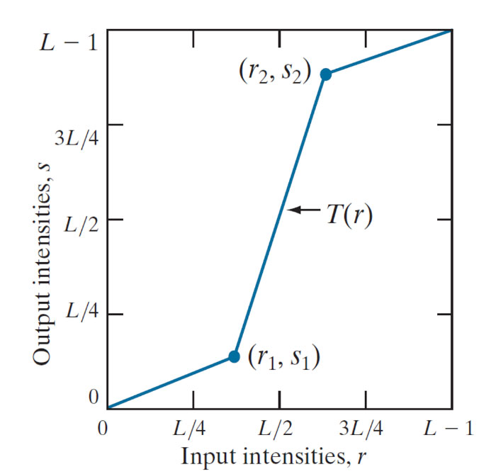
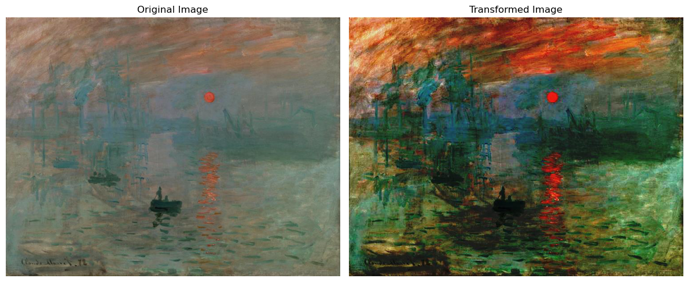
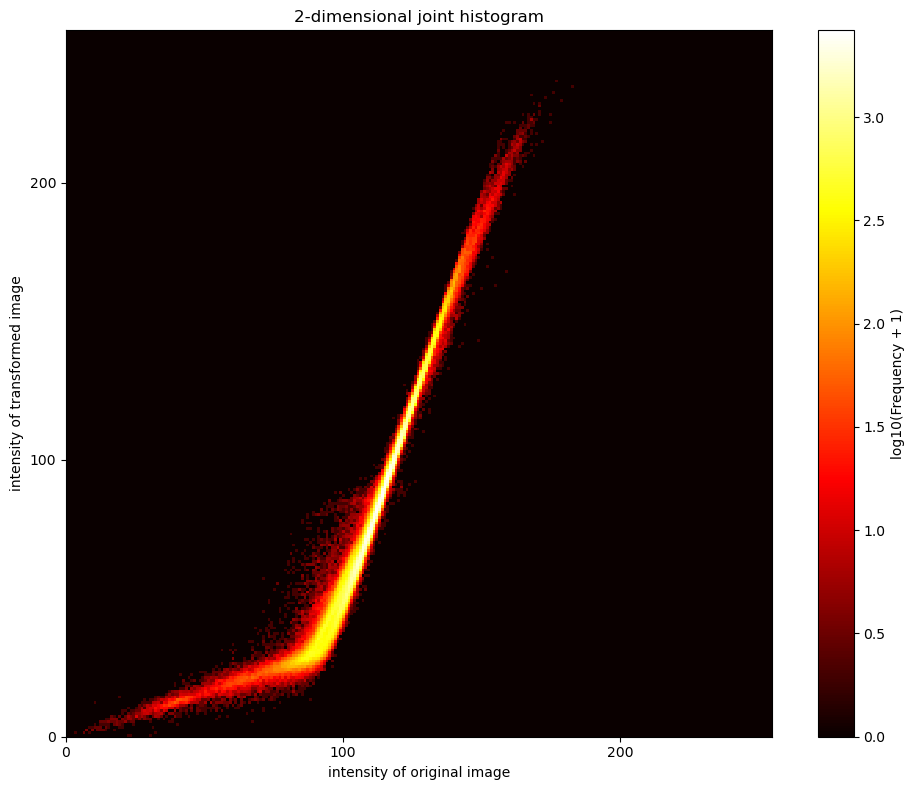
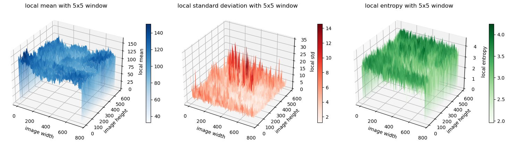
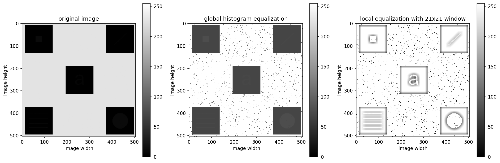

<font face="Times">

<center>

### 图像处理与可视化: Homework 1 

陈皓阳 `23307130004@m.fudan.edu.cn`

</center>

<br>

#### 1 Implement a piecewise linear transformation function (below figure) for image contrast stretching. The code should read in an image; for intensity of all pixels, use the function to compute new intensity values; and finally output/ save the image with new intensity values.





* `1.jpg` 是原始图像 (Original Image)
* `transformed_1.jpg` 是经过分段线性函数映射后对比图提升的图像 (Transformed Image)
* `comparison.jpg` 是上述两张图像的并列展示

```python
# T1
import numpy as np
from PIL import Image
import os
import matplotlib.pyplot as plt

def rgb_to_grey(image_path):
    
    img = Image.open(image_path)
    if img.mode == 'RGBA': img = img.convert('RGB')
    
    if img.mode == 'L': 
        return np.array(img)
    else:
        img_array = np.array(img)
        grey_array = 0.299 * img_array[:,:,0] + 0.587 * img_array[:,:,1] + 0.114 * img_array[:,:,2]
        return grey_array.astype(np.uint8)

def save_grey_image(image_path):
  
    grey_array = rgb_to_grey(image_path)
    grey_img_pil = Image.fromarray(grey_array)
    
    file_name = os.path.basename(image_path)
    name, ext = os.path.splitext(file_name)
    output_name = "grey_" + name + ext
    grey_img_pil.save(output_name)
    
    return output_name

def piecewise_linear_function(r, r1, s1, r2, s2, L=256):
    """
    Parameters:
        r: input intensity value
        r1: input of the first breakpoint
        s1: output of the first breakpoint
        r2: input of the second breakpoint
        s2: output of the second breakpoint
        L: total number of intensity levels
    Returns:
        s: output intensity value
    """
    if r < r1:
        s = (s1 / r1) * r
    elif r < r2:
        s = s1 + ((s2 - s1) / (r2 - r1)) * (r - r1)
    else:
        s = s2 + ((L - 1 - s2) / (L - 1 - r2)) * (r - r2)
    return s

def lookup_table(r1, s1, r2, s2, L=256):

    table = np.zeros(256, dtype=np.uint8)
    for r in range(L):
        s = piecewise_linear_function(r, r1, s1, r2, s2, L)
        table[r] = np.clip(s, 0, L-1)

    return table

def piecewise_linear_transformation(file_path, r1, s1, r2, s2, L=256):

    img = Image.open(file_path)
    if img.mode == 'RGBA': img = img.convert('RGB')    
    img_array = np.array(img)

    table = lookup_table(r1, s1, r2, s2, L)
    transformed_array = table[img_array]
    output_img = Image.fromarray(transformed_array)
    
    filename = os.path.basename(file_path)
    name, ext = os.path.splitext(filename)
    output_path = "transformed_" + name + ext
    output_img.save(output_path)

    return output_path

def show_comparison(original_path, transformed_path, output_name):

    original = Image.open(original_path)
    transformed = Image.open(transformed_path)
    
    fig, axes = plt.subplots(1, 2, figsize=(12, 6))
    
    if original.mode == 'L':
        axes[0].imshow(original, cmap='gray')
    else:
        axes[0].imshow(original)
    axes[0].set_title('Original Image')
    axes[0].axis('off')
    
    if transformed.mode == 'L':
        axes[1].imshow(transformed, cmap='gray')
    else:
        axes[1].imshow(transformed)
    axes[1].set_title('Transformed Image')
    axes[1].axis('off')
    plt.tight_layout()
    
    comparison_filename = output_name
    plt.savefig(comparison_filename, bbox_inches='tight')
    plt.close()
    
    return None

if __name__ == "__main__":

    input_file = "1.jpg"
    # input: 3/8L, output: 1/8L
    r1, s1 = 96, 32  
    # input: 5/8L, output: 7/8L
    r2, s2 = 160, 224 
    
    grey_input = save_grey_image(input_file)
    output_file = piecewise_linear_transformation(input_file, r1, s1, r2, s2)
    grey_output = save_grey_image(output_file)
    
    show_comparison(input_file, output_file, "comparison.png")
    show_comparison(grey_input, grey_output, "comparison_grey.png")
```

<br>

#### 2 (1) implement n-dimensional joint histogram and test the code on two-dimensional data; plot the results. 


* 为了绘制二维联合直方图，将彩色图片转化为灰度图片
* `grey_1.jpg` 是 `1.jpg` 对应的灰度图片 (Original Image)
* `grey_transformed_1.jpg` 是 `transformed_1.jpg` 对应的灰度图片 (Transformed Image)
* `comparison_grey.png` 是上述两张图片的并列展示



* 使用 `grey_1.jpg` 和 `grey_transformed_1.jpg` 来绘制二维联合直方图 `2d_joint_histogram.png` ，从热力图的形状来看，由于 `grey_transformed_1.jpg` 本身就是从 `grey_1.jpg` 经过分段线性函数映射而来，故其形状和分段线性函数图像相似；从颜色上来看，说明该图像在较低灰度值的像素比较多

```python
# T2 (1)
import numpy as np
from PIL import Image
import matplotlib.pyplot as plt
import os

def rgb_to_grey(image_path):
    # turn rgb to grey
    img = Image.open(image_path)
    if img.mode == 'RGBA': img = img.convert('RGB')
    
    if img.mode == 'L': 
        return np.array(img)
    else:
        img_array = np.array(img)
        grey_array = 0.299 * img_array[:,:,0] + 0.587 * img_array[:,:,1] + 0.114 * img_array[:,:,2]
        return grey_array.astype(np.uint8)

def compute_joint_histogram(n, image_paths, bins):
    """
    Parameters:
        n: dimension
        image_paths: list of image path
        bins: total number of intensity level
    Returns:
        histogram: array for plotting histogram, not histogram itself
    """
    first_img = rgb_to_grey(image_paths[0])
    height, width = first_img.shape
    
    images = [first_img]
    for i in range(1, n):
        grey_img = rgb_to_grey(image_paths[i])
        # make sure all images having the same size
        if grey_img.shape != (height, width):
            img_pil = Image.fromarray(grey_img)
            img_pil = img_pil.resize((width, height))
            grey_img = np.array(img_pil)
        
        images.append(grey_img)
    
    # n-dimension histogram array
    hist_shape = tuple([bins] * n)
    histogram = np.zeros(hist_shape, dtype=np.int32)
    
    for i in range(height):
        for j in range(width):
            indices = tuple(images[k][i, j] * bins // 256 for k in range(n))
            histogram[indices] += 1
    
    return histogram

def plot_2d_histogram(histogram):

    plt.figure(figsize=(10, 8))
    
    log_histogram = np.log10(histogram + 1)
    plt.imshow(log_histogram, cmap='hot', interpolation='none', origin='lower', 
               extent=[0, 255, 0, 255])
    
    plt.colorbar(label='log10(Frequency + 1)')
    plt.xlabel('intensity of original image')
    plt.ylabel('intensity of transformed image')
    plt.title('2-dimensional joint histogram')
    plt.xticks([0, 100, 200])
    plt.yticks([0, 100, 200])
    
    plt.tight_layout()
    plt.savefig('2d_joint_histogram.png', bbox_inches='tight')
    plt.close()


if __name__ == "__main__":

    image_paths = ["transformed_1.jpg", "1.jpg"]
    hist = compute_joint_histogram(2, image_paths, bins=256)
    plot_2d_histogram(hist)
```

<br>

#### 2 (2) implement computation of local histograms of an image using the efficient update of local histogram method introduced in local histogram processing. Note that because only one row or column of the neighborhood changes in a one-pixel translation of the neighborhood, updating the histogram obtained in the previous location with the new data introduced at each motion step is possible and efficient in computation.



* 上方图像 `local_statistics_3d.png` 并排展示了从 `grey_1.jpg` 计算得来的局部直方图，包括局部均值，局部标准差和局部熵，窗口大小为 5 x 5
* 在计算局部均值和局部熵时使用高效计算，窗口使用 Z 字形移动，也即在偶数行从左向右滑动，在奇数行从右向左滑动，当窗口滑动到边界时向下滑动；对于边界点，窗口只统计可以统计的点，没有进行填充；计算局部标准差时没有使用高效计算


```python
import numpy as np
from PIL import Image
import matplotlib.pyplot as plt
import time

def rgb_to_grey(image_path):
    
    img = Image.open(image_path)
    if img.mode == 'RGBA': img = img.convert('RGB')
    
    if img.mode == 'L': 
        return np.array(img)
    else:
        img_array = np.array(img)
        grey_array = 0.299 * img_array[:,:,0] + 0.587 * img_array[:,:,1] + 0.114 * img_array[:,:,2]
        return grey_array.astype(np.uint8)

def compute_histogram(image_path):
    # global statistics of the image
    img = Image.open(image_path)
    grey_array = rgb_to_grey(image_path)
    histogram = np.zeros(256, dtype=np.int32)
    for pixel_value in grey_array.flatten():
        histogram[pixel_value] += 1
    return histogram

def compute_local_mean(k, image_path):
    """
    the local window uses Z-move to compute the information of the next window based on the previous one
    Parameters:
        k: size of local window
        image_path
    Return:
        mean: 2-dimension array
    """
    grey_array = rgb_to_grey(image_path)
    height, width = grey_array.shape
    mean = np.zeros((height, width), dtype=np.float64)

    # initial window
    half = k // 2
    top = max(0, 0 - half)
    bottom = min(height, 0 + half + 1)
    left = max(0, 0 - half)
    right = min(width, 0 + half + 1)

    current_window = grey_array[top:bottom, left:right]
    current_sum = np.sum(current_window)
    current_count = current_window.shape[0] * current_window.shape[1]
    mean[0, 0] = current_sum / current_count

    # first row update
    for col in range(1, width):
        new_left = max(0, col - half)
        new_right = min(width, col + half + 1)
        # remove left col if exists
        if new_left > left:
            removed_col = grey_array[top: bottom, left]
            current_sum -= np.sum(removed_col)
            current_count -= (bottom - top)
        # add right col if exists
        if new_right > right:
            added_col = grey_array[top: bottom, right]
            current_sum += np.sum(added_col)
            current_count += (bottom - top)
        # renew boundary
        left, right = new_left, new_right
        mean[0, col] = current_sum / current_count

    # other row update
    for row in range(1, height):
        new_top = max(0, row - half)
        new_bottom = min(height, row + half + 1)
        # remove top row if exists
        if new_top > top:
            removed_row = grey_array[top, left:right]
            current_sum -= np.sum(removed_row)
            current_count -= (right - left)
        # add bottom row if exists
        if new_bottom > bottom:
            added_row = grey_array[bottom, left:right]
            current_sum += np.sum(added_row)
            current_count += (right - left)
        # renew boundary
        top, bottom = new_top, new_bottom

        # if even row, the window moves from the left to right
        if row % 2 == 0:  
            for col in range(1, width):
                # the same as first row update
                new_left = max(0, col - half)
                new_right = min(width, col + half + 1)
                # left, remove
                if new_left > left:
                    removed_col = grey_array[top:bottom, left]
                    current_sum -= np.sum(removed_col)
                    current_count -= (bottom - top)
                # right, add
                if new_right > right:
                    added_col = grey_array[top:bottom, new_right - 1]
                    current_sum += np.sum(added_col)
                    current_count += (bottom - top)
                
                left, right = new_left, new_right
                mean[row, col] = current_sum / current_count
        # if odd row, the window moves from the right to left
        else:  
            for col in range(width - 2, -1, -1):
                # the oppsite as first row update
                new_left = max(0, col - half)
                new_right = min(width, col + half + 1)
                # left, add
                if new_left < left:
                    added_col = grey_array[top:bottom, new_left]
                    current_sum += np.sum(added_col)
                    current_count += (bottom - top)
                # right, remove
                if new_right < right:
                    removed_col = grey_array[top:bottom, right-1]
                    current_sum -= np.sum(removed_col)
                    current_count -= (bottom - top)

                left, right = new_left, new_right
                mean[row, col] = current_sum / current_count

    return mean

def compute_local_std(k, image_path):
    # compute local standard error, but cannot use 
    grey_array = rgb_to_grey(image_path)
    height, width = grey_array.shape
    std = np.zeros((height, width), dtype=np.float64)
    
    for row in range(height):
        for col in range(width):
            half = k // 2
            top = max(0, row - half)
            bottom = min(height, row + half + 1)
            left = max(0, col - half)
            right = min(width, col + half + 1)
            
            local_window = grey_array[top:bottom, left:right]
            std[row, col] = np.std(local_window)

    return std

def compute_local_entropy(k, image_path):
    """
    the local window uses Z-move
    Return:
        entropy: 2-dimension array
    """
    grey_array = rgb_to_grey(image_path)
    height, width = grey_array.shape
    entropy = np.zeros((height, width), dtype=np.float64)

    # initial window
    half = k // 2
    top = max(0, 0 - half)
    bottom = min(height, 0 + half + 1)
    left = max(0, 0 - half)
    right = min(width, 0 + half + 1)

    current_window = grey_array[top:bottom, left:right]
    current_hist = np.zeros(256, dtype=np.int32)
    for pixel in current_window.flatten():
        current_hist[pixel] += 1
    
    current_count = current_window.shape[0] * current_window.shape[1]
    entropy[0, 0] = compute_entropy_from_hist(current_hist, current_count)

    # first row update
    for col in range(1, width):
        new_left = max(0, col - half)
        new_right = min(width, col + half + 1)
        # remove left col if exists
        if new_left > left:
            removed_col = grey_array[top: bottom, left]
            for pixel in removed_col.flatten():
                current_hist[pixel] -= 1
            current_count -= (bottom - top)
        # add right col if exists
        if new_right > right:
            added_col = grey_array[top: bottom, right]
            for pixel in added_col.flatten():
                current_hist[pixel] += 1
            current_count += (bottom - top)
        # renew boundary
        left, right = new_left, new_right
        entropy[0, col] = compute_entropy_from_hist(current_hist, current_count)

    # other row update
    for row in range(1, height):
        new_top = max(0, row - half)
        new_bottom = min(height, row + half + 1)
        # remove top row if exists
        if new_top > top:
            removed_row = grey_array[top, left:right]
            for pixel in removed_row.flatten():
                current_hist[pixel] -= 1
            current_count -= (right - left)
        # add bottom row if exists
        if new_bottom > bottom:
            added_row = grey_array[bottom, left:right]
            for pixel in added_row.flatten():
                current_hist[pixel] += 1
            current_count += (right - left)
        # renew boundary
        top, bottom = new_top, new_bottom

        # if even row, the window moves from the left to right
        if row % 2 == 0:  
            for col in range(1, width):
                # the same as first row update
                new_left = max(0, col - half)
                new_right = min(width, col + half + 1)
                
                if new_left > left:
                    removed_col = grey_array[top:bottom, left]
                    for pixel in removed_col.flatten():
                        current_hist[pixel] -= 1
                    current_count -= (bottom - top)
                
                if new_right > right:
                    added_col = grey_array[top:bottom, right]
                    for pixel in added_col.flatten():
                        current_hist[pixel] += 1
                    current_count += (bottom - top)
                
                left, right = new_left, new_right
                entropy[row, col] = compute_entropy_from_hist(current_hist, current_count)
        # if odd row, the window moves from the right to left
        else:  
            for col in range(width - 2, -1, -1):
                # the opposite as first row update
                new_left = max(0, col - half)
                new_right = min(width, col + half + 1)
                
                if new_right < right:
                    removed_col = grey_array[top:bottom, right-1]
                    for pixel in removed_col.flatten():
                        current_hist[pixel] -= 1
                    current_count -= (bottom - top)
                
                if new_left < left:
                    added_col = grey_array[top:bottom, new_left]
                    for pixel in added_col.flatten():
                        current_hist[pixel] += 1
                    current_count += (bottom - top)
                
                left, right = new_left, new_right
                entropy[row, col] = compute_entropy_from_hist(current_hist, current_count)

    return entropy

def compute_entropy_from_hist(hist, count):
    entropy = 0.0
    for freq in hist:
        if freq > 0:
            p = freq / count
            entropy -= p * np.log2(p)
    return entropy

# plot function, three statistics together
def plot_local_statistics(mean, std, entropy, k):

    fig = plt.figure(figsize=(15, 6))
    height, width = mean.shape
    X, Y = np.meshgrid(np.arange(width), np.arange(height))
    
    # local mean
    ax1 = fig.add_subplot(131, projection='3d')
    surf1 = ax1.plot_surface(X, Y, mean, cmap='Blues', alpha=1.0)
    ax1.set_title(f'local mean with {k}x{k} window')
    ax1.set_xlabel('image width')
    ax1.set_ylabel('image height')
    ax1.set_zlabel('local mean')
    plt.colorbar(surf1, ax=ax1, shrink=0.5, pad=0.1)
    
    # local std
    ax2 = fig.add_subplot(132, projection='3d')
    surf2 = ax2.plot_surface(X, Y, std, cmap='Reds', alpha=1.0)
    ax2.set_title(f'local standard deviation with {k}x{k} window')
    ax2.set_xlabel('image width')
    ax2.set_ylabel('image height')
    ax2.set_zlabel('local std')
    plt.colorbar(surf2, ax=ax2, shrink=0.5, pad=0.1)
    
    # local entropy
    ax3 = fig.add_subplot(133, projection='3d')
    surf3 = ax3.plot_surface(X, Y, entropy, cmap='Greens', alpha=1.0)
    ax3.set_title(f'local entropy with {k}x{k} window')
    ax3.set_xlabel('image width')
    ax3.set_ylabel('image height')
    ax3.set_zlabel('local entropy')
    plt.colorbar(surf3, ax=ax3, shrink=0.5, pad=0.1)
    
    plt.tight_layout()
    plt.savefig('local_statistics_3d.png', bbox_inches='tight')
    plt.show()


if __name__ == "__main__":

    image_path = "grey_1.jpg"
    k = 5  
    
    # compute
    start_time = time.time()
    mean = compute_local_mean(k, image_path)
    print(f"mean: {time.time() - start_time:.2f}s")
    start_time = time.time()
    std = compute_local_std(k, image_path)
    print(f"std: {time.time() - start_time:.2f}s")
    start_time = time.time()
    entropy = compute_local_entropy(k, image_path)
    print(f"entropy: {time.time() - start_time:.2f}s")
    
    # plot
    plot_local_statistics(mean, std, entropy, k)
```

<br>

#### 3 (1) Implement the algorithm of local histogram equalization: (1) first implement histogram equalization algorithm, and then (2) implement the local histogram equalization using efficient computation of local histogram. Please test your code on images and show the results in your report.



* `comparison_equilization.png` 是原始图像 `3.png`，以及对该图像进行全局直方图均衡化得到的 `global_equilized_3.png`，和进行局部直方图均衡化得到的 `local_equilized_3.png` 的并列展示，局部窗口使用 21 x 21
* 全局直方图均衡化无法明显地分辨出黑色区域内的灰色图形，而局部直方图均衡化可以明显分辨，但两种方法的劣势在于会产生大量噪音

```python
import numpy as np
from PIL import Image
import os
import time
import matplotlib.pyplot as plt

# T3(1)
def rgb_to_grey(image_path):
    
    img = Image.open(image_path)
    if img.mode == 'RGBA': img = img.convert('RGB')
    
    if img.mode == 'L': 
        return np.array(img)
    else:
        img_array = np.array(img)
        grey_array = 0.299 * img_array[:,:,0] + 0.587 * img_array[:,:,1] + 0.114 * img_array[:,:,2]
        return grey_array.astype(np.uint8)

def global_histogram_equalization(image_path, L=256, save_result=True):

    grey_array = rgb_to_grey(image_path)
    height, width = grey_array.shape
    
    histogram = np.zeros(L, dtype=np.int32)
    for pixel_value in grey_array.flatten():
        histogram[pixel_value] += 1
    
    # compute cdf and make the equilization
    freq = np.zeros(256, dtype=np.float64)
    freq[0] = histogram[0]
    for i in range(1, 256):
        freq[i] = freq[i-1] + histogram[i]
    
    total_pixels = height * width
    cdf_normalized = freq / total_pixels
    
    transform = np.round(cdf_normalized * (L - 1)).astype(np.uint8)
    
    equalized_image = np.zeros_like(grey_array)
    for i in range(height):
        for j in range(width):
            original_value = grey_array[i, j]
            equalized_image[i, j] = transform[original_value]
    
    # save equilizad image
    if save_result:
        equalized_img_pil = Image.fromarray(equalized_image)
        file_name = os.path.basename(image_path)
        name, ext = os.path.splitext(file_name)
        output_name = "global_equalized_" + name + ext
        equalized_img_pil.save(output_name)
    
    return equalized_image


# T3(2)
def local_histogram_equalization(k, image_path, L=256, save_result=True):
    """
    the local window uses Z-move. for each window, only equilize the center pixel
    Parameters:
        k: size of local window
        image_path
    Return:
        equilized: 2-dimension array
    """
    grey_array = rgb_to_grey(image_path)
    height, width = grey_array.shape
    equalized = np.zeros_like(grey_array)
    
    # initialize first window at (0, 0)
    half = k // 2
    top = max(0, 0 - half)
    bottom = min(height, 0 + half + 1)
    left = max(0, 0 - half)
    right = min(width, 0 + half + 1)
    
    # build initial histogram
    current_hist = np.zeros(256, dtype=np.int32)
    for i in range(top, bottom):
        for j in range(left, right):
            current_hist[grey_array[i, j]] += 1
    current_count = (bottom - top) * (right - left)
    
    # compute cdf and equalize center pixel
    center_value = grey_array[0, 0]
    cdf = np.sum(current_hist[:center_value + 1]) / current_count
    equalized[0, 0] = np.round(cdf * (L-1)).astype(np.uint8)
    
    # first row: left to right
    for col in range(1, width):
        new_left = max(0, col - half)
        new_right = min(width, col + half + 1)
        # remove left column
        if new_left > left:
            for i in range(top, bottom):
                current_hist[grey_array[i, left]] -= 1
            current_count -= (bottom - top)
        # add right column
        if new_right > right:
            for i in range(top, bottom):
                current_hist[grey_array[i, new_right - 1]] += 1
            current_count += (bottom - top)
        
        left, right = new_left, new_right
        
        # equalize center pixel
        center_value = grey_array[0, col]
        cdf = np.sum(current_hist[:center_value + 1]) / current_count
        equalized[0, col] = np.round(cdf * (L-1)).astype(np.uint8)
    
    # other rows: Z-shape
    for row in range(1, height):
        new_top = max(0, row - half)
        new_bottom = min(height, row + half + 1)
        # remove top row
        if new_top > top:
            for j in range(left, right):
                current_hist[grey_array[top, j]] -= 1
            current_count -= (right - left)
        # add bottom row
        if new_bottom > bottom:
            for j in range(left, right):
                current_hist[grey_array[bottom, j]] += 1
            current_count += (right - left)
        
        top, bottom = new_top, new_bottom
        
        # even row: left to right
        if row % 2 == 0: 
            for col in range(width):
                if col > 0:
                    new_left = max(0, col - half)
                    new_right = min(width, col + half + 1)
                    # remove left column
                    if new_left > left:
                        for i in range(top, bottom):
                            current_hist[grey_array[i, left]] -= 1
                        current_count -= (bottom - top)
                    # add right column
                    if new_right > right:
                        for i in range(top, bottom):
                            current_hist[grey_array[i, new_right - 1]] += 1
                        current_count += (bottom - top)
                    
                    left, right = new_left, new_right
                
                # equalize center pixel
                center_value = grey_array[row, col]
                cdf = np.sum(current_hist[:center_value + 1]) / current_count
                equalized[row, col] = np.round(cdf * (L-1)).astype(np.uint8)

        # odd row: right to left
        else: 
            for col in range(width - 1, -1, -1):
                if col < width - 1:
                    new_left = max(0, col - half)
                    new_right = min(width, col + half + 1)
                    # remove right column
                    if new_right < right:
                        for i in range(top, bottom):
                            current_hist[grey_array[i, right - 1]] -= 1
                        current_count -= (bottom - top)
                    # add left column
                    if new_left < left:
                        for i in range(top, bottom):
                            current_hist[grey_array[i, new_left]] += 1
                        current_count += (bottom - top)
                    
                    left, right = new_left, new_right
                
                # equalize center pixel
                center_value = grey_array[row, col]
                cdf = np.sum(current_hist[:center_value + 1]) / current_count
                equalized[row, col] = np.round(cdf * (L-1)).astype(np.uint8)
    
    # save equalized image
    if save_result:
        equalized_img_pil = Image.fromarray(equalized)
        file_name = os.path.basename(image_path)
        name, ext = os.path.splitext(file_name)
        output_name = "local_equalized_" + name + ext
        equalized_img_pil.save(output_name)
    
    return equalized

# plot
def plot_comparison(original_array, global_equalized, local_equalized, k):

    fig, axes = plt.subplots(1, 3, figsize=(15, 6))

    # original image
    im1 = axes[0].imshow(original_array, cmap='gray', vmin=0, vmax=255)
    axes[0].set_title('original image')
    axes[0].set_xlabel('image width')
    axes[0].set_ylabel('image height')
    axes[0].axis('on')
    plt.colorbar(im1, ax=axes[0], shrink=0.8, pad=0.05)

    # global equilization
    im2 = axes[1].imshow(global_equalized, cmap='gray', vmin=0, vmax=255)
    axes[1].set_title('global histogram equalization')
    axes[1].set_xlabel('image width')
    axes[1].set_ylabel('image height')
    axes[1].axis('on')
    plt.colorbar(im2, ax=axes[1], shrink=0.8, pad=0.05)

    # local equilization
    im3 = axes[2].imshow(local_equalized, cmap='gray', vmin=0, vmax=255)
    axes[2].set_title(f'local equalization with {k}x{k} window')
    axes[2].set_xlabel('image width')
    axes[2].set_ylabel('image height')
    axes[2].axis('on')
    plt.colorbar(im3, ax=axes[2], shrink=0.8, pad=0.05)
    
    plt.tight_layout()
    plt.savefig('comparison_equilization.png', bbox_inches='tight', dpi=150)
    plt.show()


if __name__ == "__main__":

    original_path = "3.png"
    original = rgb_to_grey(original_path)
    k = 21
    
    start_time = time.time()
    global_result = global_histogram_equalization(original_path)
    print(f"global equilization: {time.time() - start_time:.2f}s")
    start_time = time.time()
    local_result = local_histogram_equalization(k, original_path)
    print(f"local equilization: {time.time() - start_time:.2f}s")

    plot_comparison(original, global_result, local_result, k)
```


</font>