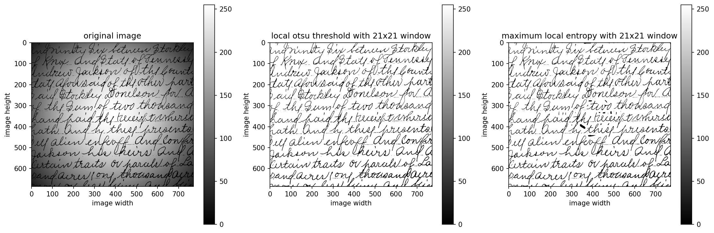
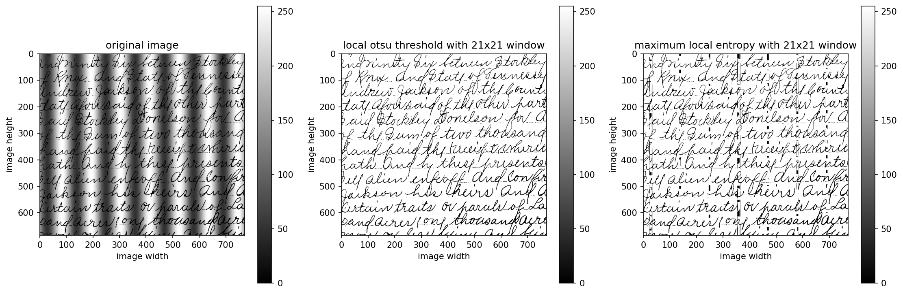
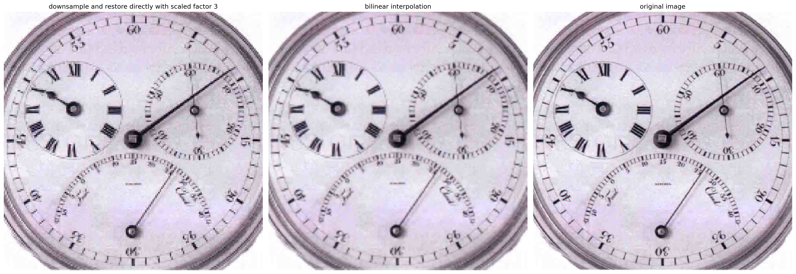

<font face="Times">

<center>

### 图像处理与可视化: Homework 2

陈皓阳 `23307130004@m.fudan.edu.cn`

</center>

<br>

#### [HW2-1] Restate the Basic Global Thresholding (BGT) algorithm so that it uses the histogram of an image instead of the image itself. (Please refer to the statement of OTSU algorithm)

基于直方图的基本全局阈值分割 (BGT) 算法：

1. 计算输入图像的归一化直方图。使用 $p_i, i=0,1,2,\dots,L-1$ 表示该直方图的各个分量。

2. 为全局阈值 T 选择一个初始估计值。
根据当前阈值 T，将直方图分为 灰度值小于等于 T 的像素，和灰度值小于等于T的像素，即 $i \leq T$ 的像素，并计算两组的加权平均灰度值。
$$m_1(T) = \frac{\sum_{i=0}^{T} i \cdot p_i}{\sum_{i=0}^{T} p_i}, \quad m_2(T) = \frac{\sum_{i=T+1}^{L-1} i \cdot p_i}{\sum_{i=T+1}^{L-1} p_i}$$

3. 计算新的阈值。
$$T' = \frac{1}{2}(m_1(T) + m_2(T))$$

4. 重复步骤2到步骤4，直到连续迭代中的两个T值间的差小于某个预定义的值 $\Delta T$，即 $|T' - T| < \Delta T$

<br>

#### [HW2-2] Design an algorithm of locally adaptive thresholding based on local OTSU or maximum of local entropy; implement the algorithm and test it on exemplar image(s).



* `comparison_threshold_2-2-1.png` 是对原始图片 (圆形噪音) `2-2-1.png` 的灰度图，基于局部最大类间方差的阈值处理 `local_otsu_threshold_2-2-1.png` 以及 基于局部最大熵的阈值处理 `local_entropy_threshold_2-2-1.png` 的并列展示。



* `comparison_threshold_2-2-2.png` 是对原始图片 (条纹噪音) `2-2-2.png` 的灰度图，基于局部最大类间方差的阈值处理 `local_otsu_threshold_2-2-2.png` 以及 基于局部最大熵的阈值处理 `local_entropy_threshold_2-2-2.png` 的并列展示。

* 两个算法采用基于滑动窗口的高效更新方式，通过 Z 字形移动遍历图像。对于每个像素，算法维护当前窗口的直方图统计信息，当窗口移动时，只需移除离开窗口的像素并添加新进入窗口的像素，避免重复计算整个窗口的直方图。

* 局部最大类间方差原理: 该方法基于《数字图像处理(第四版) 10.3.3 使用 Otsu 方法的最优全局阈值处理》中的 Otsu 算法，将其推广到局部情况。对于每个局部窗口，算法遍历灰度阈值 k，并计算类间方差，确定使类间方差最小的灰度阈值。类间方差公式为：
$$\sigma_B^2(k) = \frac{[m_G P_1(k) - m(k)]^2}{P_1(k)[1 - P_1(k)]}$$
其中 $m_G$ 是全局均值，$P_1(k)$ 是灰度值小于等于 $k$ 的像素的累计概率，$m(k)$ 是灰度值小于等于 $k$ 的像素的加权平均灰度值（累计均值）。算法遍历阈值 $k$ 时使用步长为 4 以节约时间。

* 局部最大类间方差的具体实现方面，代码中使用 `best_threshold = min(best_threshold, 0.5 * mG)`，其中 `min` 中的 `best_threshold` 是通过局部 Otsu 获得的阈值，与局部平均值的 0.5 倍取最小值后，获得实际的局部阈值。实验发现，单纯使用局部 Otsu 获得的阈值会在白色背景处产生黑色斑点，而增加 `min` 处理后可以解决这个问题。

* 局部最大熵原理: 最大熵方法基于信息论，其核心思想是选择能够最大化分割后两个类别的信息熵的阈值，其直觉是：好的阈值应该使分割后的两个类别都包含尽可能多的信息（高熵），避免产生信息贫乏的分割。对于阈值 $k$，总熵为：
$$H(k) = -\sum_{i=0}^{k} \frac{p_i}{P_1(k)} \log_2 \frac{p_i}{P_1(k)} - \sum_{i=k+1}^{L-1} \frac{p_i}{P_2(k)} \log_2 \frac{p_i}{P_2(k)}$$
其中 $P_1(k) = \sum_{i=0}^{k} p_i$，$P_2(k) = 1 - P_1(k)$。算法同样使用步长为 4 遍历阈值以节约时间。

* 可以进一步简化全局最大熵的公式：将总熵 $H(k) = H_1 + H_2$ 展开，其中 $H_1 = -\sum_{i=0}^{k} \frac{p_i}{P_1} \log_2 \frac{p_i}{P_1}$，$H_2 = -\sum_{i=k+1}^{L-1} \frac{p_i}{P_2} \log_2 \frac{p_i}{P_2}$，并利用利用全图像熵 $H(I) = -\sum_{i=0}^{L-1} p_i \log_2 p_i$ 和恒等式 $\sum_{i=k+1}^{L-1} p_i \log_2 p_i = -H(I) - \sum_{i=0}^{k} p_i \log_2 p_i$，可推导出：
$$H(k) = -\frac{1}{P_1} \sum_{i=0}^{k} p_i \log_2 p_i + \log_2 P_1 + \frac{1}{P_2} [H(I) + \sum_{i=0}^{k} p_i \log_2 p_i] + \log_2 P_2$$

* 局部最大熵的具体实现方面，代码没有让 $H1$ 与 $H2$ 权重相等，而是最大化 $\hat{H}(k) = 0.1 H(1) + 0.9 H(2)$，这样算法更关注高灰度值 (灰色噪音和白色背景)，最终使得找到的阈值较低，可以分离 黑色字体 与 灰色噪音+白色背景。实验发现，如果使用原始权重的局部最大熵，处理得到的图片会产生大片黑色噪音，而改进最大熵几乎可以解决这个问题，只是在阴影干扰最深的地方，还会识别出阴影的条状轮廓或环状轮廓。

```python
# [HW2-2]
import numpy as np
from PIL import Image
import matplotlib.pyplot as plt
import os
import time

def rgb_to_grey(image_path):
    
    img = Image.open(image_path)
    if img.mode == 'RGBA': img = img.convert('RGB')
    
    if img.mode == 'L': 
        return np.array(img)
    else:
        img_array = np.array(img)
        grey_array = 0.299 * img_array[:,:,0] + 0.587 * img_array[:,:,1] + 0.114 * img_array[:,:,2]
        return grey_array.astype(np.uint8)

def save_grey_image(image_path):
  
    grey_array = rgb_to_grey(image_path)
    grey_img_pil = Image.fromarray(grey_array)
    
    file_name = os.path.basename(image_path)
    name, ext = os.path.splitext(file_name)
    output_name = "grey_" + name + ext
    grey_img_pil.save(output_name)
    
    return output_name

def local_otsu_threshold(k, image_path, L=256, save_result=True):
    """
    the local window uses Z-move to conduct locally adaptive thresholding using method of local OTSU or maximum local entropy
    Parameters:
        k: size of local window
        image_path
        method: 
            local OTSU: for every threshold k, compute sigma2 = [m_{G}P1 - m]^{2} / [P1(1-P1)]
                        where P1 and m is the cdf and the weighted average of pixel of which intensity up to k, m is the global weighted average
    Return:
        threshold: 2-dimension array
    """
    grey_array = rgb_to_grey(image_path)
    height, width = grey_array.shape
    threshold = np.zeros_like(grey_array)
    
    # initialize first window at (0, 0)
    half = k // 2
    top = max(0, 0 - half)
    bottom = min(height, 0 + half + 1)
    left = max(0, 0 - half)
    right = min(width, 0 + half + 1)
    
    # build initial histogram
    current_hist = np.zeros(L, dtype=np.int32)
    for i in range(top, bottom):
        for j in range(left, right):
            current_hist[grey_array[i, j]] += 1
    current_count = (bottom - top) * (right - left)
    # compute initial threshold for center pixel
    threshold[0, 0] = compute_otsu_threshold(current_hist, current_count, grey_array[0, 0], L)
    
    # first row: left to right
    for col in range(1, width):
        new_left = max(0, col - half)
        new_right = min(width, col + half + 1)
        # remove left column
        if new_left > left:
            for i in range(top, bottom):
                current_hist[grey_array[i, left]] -= 1
            current_count -= (bottom - top)
        # add right column
        if new_right > right:
            for i in range(top, bottom):
                current_hist[grey_array[i, new_right - 1]] += 1
            current_count += (bottom - top)
        
        left, right = new_left, new_right
        # compute threshold for center pixel
        threshold[0, col] = compute_otsu_threshold(current_hist, current_count, grey_array[0, col], L)
    
    # other rows: Z-shape movement
    for row in range(1, height):
        new_top = max(0, row - half)
        new_bottom = min(height, row + half + 1)
        # remove top row
        if new_top > top:
            for j in range(left, right):
                current_hist[grey_array[top, j]] -= 1
            current_count -= (right - left)
        # add bottom row
        if new_bottom > bottom:
            for j in range(left, right):
                current_hist[grey_array[bottom, j]] += 1
            current_count += (right - left)
        
        top, bottom = new_top, new_bottom
        
        # even row: left to right
        if row % 2 == 0: 
            for col in range(width):
                if col > 0:
                    new_left = max(0, col - half)
                    new_right = min(width, col + half + 1)
                    # remove left column
                    if new_left > left:
                        for i in range(top, bottom):
                            current_hist[grey_array[i, left]] -= 1
                        current_count -= (bottom - top)
                    # add right column
                    if new_right > right:
                        for i in range(top, bottom):
                            current_hist[grey_array[i, new_right - 1]] += 1
                        current_count += (bottom - top)
                    
                    left, right = new_left, new_right

                # compute threshold for center pixel
                threshold[row, col] = compute_otsu_threshold(current_hist, current_count, grey_array[row, col], L)

        # odd row: right to left
        else: 
            for col in range(width - 1, -1, -1):
                if col < width - 1:
                    new_left = max(0, col - half)
                    new_right = min(width, col + half + 1)
                    # remove right column
                    if new_right < right:
                        for i in range(top, bottom):
                            current_hist[grey_array[i, right - 1]] -= 1
                        current_count -= (bottom - top)
                    # add left column
                    if new_left < left:
                        for i in range(top, bottom):
                            current_hist[grey_array[i, new_left]] += 1
                        current_count += (bottom - top)
                    
                    left, right = new_left, new_right
                
                # compute threshold for center pixel
                threshold[row, col] = compute_otsu_threshold(current_hist, current_count, grey_array[row, col], L)
    
    # save processed image
    if save_result:
        threshold_img = Image.fromarray(threshold)
        file_name = os.path.basename(image_path)
        name, ext = os.path.splitext(file_name)
        output_name = "local_otsu_threshold_" + name + ext
        threshold_img.save(output_name)

    return threshold

# auxiliary function of local OTSU
def compute_otsu_threshold(hist, count, center_value, L):
    """
    compute otsu threshold for a given histogram with adaptive strategy
    Parameters:
        hist: histogram array
        count: total pixel count
        center_value: center pixel value for threshold
    Return:
        thresholded value (0 or L-1)
    """
    if count == 0:
        return 0
    
    # normalize histogram and compute cdf
    p = hist.astype(np.float64) / count
    P1 = np.zeros(L)
    m1 = np.zeros(L)
    P1[0] = p[0]
    m1[0] = 0
    # local mean
    for k in range(1, L):
        P1[k] = P1[k-1] + p[k]
        m1[k] = m1[k-1] + k * p[k]
    # global mean
    mG = np.sum(np.arange(L) * p)
    
    # compute between-class variance for each threshold
    max_variance = -1
    best_threshold = 0
    for k in range(0, L, 4):
        if P1[k] > 0 and P1[k] < 1:
            variance = (mG * P1[k] - m1[k])**2 / (P1[k] * (1 - P1[k]))
            if variance > max_variance:
                max_variance = variance
                best_threshold = k

    best_threshold = min(best_threshold, 0.5 * mG)
    return L-1 if center_value > best_threshold else 0


def maximum_local_entropy_threshold(k, image_path, L=256, save_result=True):
    """
    the local window uses Z-move to conduct locally adaptive thresholding using method of local OTSU or maximum local entropy
    Parameters:
        k: size of local window
        image_path
        method: 
            maximum local entropy: for every threshold k, compute entropy = -sum((p_{i}/P1) * log2(p_{i}/P1)) for i=0 to k 
                                                                          + -sum((p_{i}/P2) * log2(p_{i}/P2)) for i=k+1 to L-1
                                   where P1 + P2 = 1
                                   after simplification, we have entropy =  - 1/P1 sum(p_{i} * log2(p_{i})) for i=0 to k + log2(P1) 
                                                                            + 1/(1-P1) (H(I) + sum(p_{i} * log2(p_{i})) for i=0 to k) + log2(1-P1)
                                   where H(I) = - sum(p_{i} * log2(p_{i})) for i=0 to L-1
    Return:
        threshold: 2-dimension array
    """
    grey_array = rgb_to_grey(image_path)
    height, width = grey_array.shape
    threshold = np.zeros_like(grey_array)
    
    # initialize first window at (0, 0)
    half = k // 2
    top = max(0, 0 - half)
    bottom = min(height, 0 + half + 1)
    left = max(0, 0 - half)
    right = min(width, 0 + half + 1)
    
    # build initial histogram
    current_hist = np.zeros(L, dtype=np.int32)
    for i in range(top, bottom):
        for j in range(left, right):
            current_hist[grey_array[i, j]] += 1
    current_count = (bottom - top) * (right - left)
    
    # compute initial threshold for center pixel
    threshold[0, 0] = compute_entropy_threshold(current_hist, current_count, grey_array[0, 0], L)
    
    # first row: left to right
    for col in range(1, width):
        new_left = max(0, col - half)
        new_right = min(width, col + half + 1)
        # remove left column
        if new_left > left:
            for i in range(top, bottom):
                current_hist[grey_array[i, left]] -= 1
            current_count -= (bottom - top)
        # add right column
        if new_right > right:
            for i in range(top, bottom):
                current_hist[grey_array[i, new_right - 1]] += 1
            current_count += (bottom - top)
        
        left, right = new_left, new_right
        
        # Compute threshold for center pixel
        threshold[0, col] = compute_entropy_threshold(current_hist, current_count, grey_array[0, col], L)
    
    # other rows: Z-move
    for row in range(1, height):
        new_top = max(0, row - half)
        new_bottom = min(height, row + half + 1)
        # remove top row
        if new_top > top:
            for j in range(left, right):
                current_hist[grey_array[top, j]] -= 1
            current_count -= (right - left)
        # add bottom row
        if new_bottom > bottom:
            for j in range(left, right):
                current_hist[grey_array[bottom, j]] += 1
            current_count += (right - left)
        
        top, bottom = new_top, new_bottom
        
        # even row: left to right
        if row % 2 == 0: 
            for col in range(width):
                if col > 0:
                    new_left = max(0, col - half)
                    new_right = min(width, col + half + 1)
                    # remove left column
                    if new_left > left:
                        for i in range(top, bottom):
                            current_hist[grey_array[i, left]] -= 1
                        current_count -= (bottom - top)
                    # add right column
                    if new_right > right:
                        for i in range(top, bottom):
                            current_hist[grey_array[i, new_right - 1]] += 1
                        current_count += (bottom - top)
                    
                    left, right = new_left, new_right
                
                # compute threshold for center pixel
                threshold[row, col] = compute_entropy_threshold(current_hist, current_count, grey_array[row, col], L)

        # odd row: right to left
        else: 
            for col in range(width - 1, -1, -1):
                if col < width - 1:
                    new_left = max(0, col - half)
                    new_right = min(width, col + half + 1)
                    # remove right column
                    if new_right < right:
                        for i in range(top, bottom):
                            current_hist[grey_array[i, right - 1]] -= 1
                        current_count -= (bottom - top)
                    # add left column
                    if new_left < left:
                        for i in range(top, bottom):
                            current_hist[grey_array[i, new_left]] += 1
                        current_count += (bottom - top)
                    
                    left, right = new_left, new_right
                
                # compute threshold for center pixel
                threshold[row, col] = compute_entropy_threshold(current_hist, current_count, grey_array[row, col], L)
    
    # save processed image
    if save_result:
        threshold_img = Image.fromarray(threshold)
        file_name = os.path.basename(image_path)
        name, ext = os.path.splitext(file_name)
        output_name = "local_entropy_threshold_" + name + ext
        threshold_img.save(output_name)

    return threshold

# auxiliary function of maximum local entropy
def compute_entropy_threshold(hist, count, center_value, L):
    """
    compute maximum entropy threshold for a given histogram
    Parameters:
        hist: histogram array
        count: total pixel count
        center_value: center pixel value for thresholding
    Return:
        threshold value (0 or L-1)
    """
    if count == 0:
        return 0
    
    # normalize histogram and compute cdf
    p = hist.astype(np.float64) / count
    P1 = np.zeros(L)
    S = np.zeros(L)
    P1[0] = p[0]    
    S[0] = p[0] * np.log2(p[0]) if p[0] > 0 else 0
    # entropy =  - 1/P1 sum(p_{i} * log2(p_{i})) for i=0 to k + log2(P1) 
    #            + 1/(1-P1) (H(I) + sum(p_{i} * log2(p_{i})) for i=0 to k) + log2(1-P1)
    for k in range(1, L):
        P1[k] = P1[k-1] + p[k]
        S[k] = S[k-1] + p[k] * np.log2(p[k]) if p[k] > 0 else S[k-1]

    max_entropy = -1
    best_threshold = 0

    for k in range(0, L, 4):
        if P1[k] > 0 and P1[k] < 1:
            P2 = 1 - P1[k]
            # maximum weighted local entropy, more attention to low intensity pixel, the writing 
            total_entropy = 0.1 * (-1/P1[k] * S[k] + np.log2(P1[k])) + 0.9 * (1/P2 * (-S[L-1] + S[k]) + np.log2(P2))
            if total_entropy > max_entropy:
                max_entropy = total_entropy
                best_threshold = k
    
    # apply threshold to center pixel
    return L-1 if center_value > best_threshold else 0


# plot
def plot_comparison(original_array, otsu_threshold, entropy_threshold, input_image, k):

    fig, axes = plt.subplots(1, 3, figsize=(15, 6))

    # original image
    im1 = axes[0].imshow(original_array, cmap='grey', vmin=0, vmax=255)
    axes[0].set_title('original image')
    axes[0].set_xlabel('image width')
    axes[0].set_ylabel('image height')
    axes[0].axis('on')
    plt.colorbar(im1, ax=axes[0], shrink=0.8, pad=0.05)

    # local otsu threshold
    im2 = axes[1].imshow(otsu_threshold, cmap='gray', vmin=0, vmax=255)
    axes[1].set_title(f'local otsu threshold with {k}x{k} window')
    axes[1].set_xlabel('image width')
    axes[1].set_ylabel('image height')
    axes[1].axis('on')
    plt.colorbar(im2, ax=axes[1], shrink=0.8, pad=0.05)

    # maximum local entropy
    im3 = axes[2].imshow(entropy_threshold, cmap='gray', vmin=0, vmax=255)
    axes[2].set_title(f'maximum local entropy with {k}x{k} window')
    axes[2].set_xlabel('image width')
    axes[2].set_ylabel('image height')
    axes[2].axis('on')
    plt.colorbar(im3, ax=axes[2], shrink=0.8, pad=0.05)
    
    plt.tight_layout()
    input_name = os.path.basename(input_image)
    name, _ = os.path.splitext(input_name)
    plt.savefig(f'comparison_threshold_{name}.png', bbox_inches='tight', dpi=150)
    plt.close()  


def main(input_image, k):

    grey_image_array = rgb_to_grey(input_image)     
    
    start_time = time.time()
    otsu_image = local_otsu_threshold(k, input_image)
    print(f"local otsu threshold of {input_image}: {time.time() - start_time:.2f}s")
    start_time = time.time()
    entropy_image = maximum_local_entropy_threshold(k, input_image)
    print(f"maximum local entropy threshold of {input_image}: {time.time() - start_time:.2f}s")
    print("\n")
    
    plot_comparison(grey_image_array, otsu_image, entropy_image, input_image, k)

if __name__ == "__main__":

    k = 21
    main("2-2-1.png", k)
    main("2-2-2.png", k)
```

<br>

#### [HW2-3] 编程实现线性插值算法(不能调用某个算法库里面的插值函数)，并应用：读出一幅图像，利用线性插值把图片空间分辨率放大N倍，然后保存图片。



* `comparison_interpolation_3_2-3.png` 是对原始图像 `2-3.png` 进行下采样后使用最近邻内插恢复至原始图像大小的结果 `simple_restore_2-3.png`，对原始图像进行下采样后使用双线性插值算法恢复至原始图片大小的结果 `bilinear_restore_2-3.png` 以及原始图像 `2-3.png` 的并列展示。 

* 双线性插值算法的原理：将其分解为多个一元线性插值。首先，在 x 方向进行两次一维线性插值：
$$f(R_1) = f(0,0)(1-x) + f(1,0)x, \quad f(R_2) = f(0,1)(1-x) + f(1,1)x$$
之后，在 y 方向进行一次一维线性插值：
$$v(x,y) = f(R_1)(1-y) + f(R_2)y$$
代入并展开：
$$v(x,y) = [f(0,0)(1-x) + f(1,0)x](1-y) + [f(0,1)(1-x) + f(1,1)x]y$$

* 双线性插值算法的实现方面，为了进行对比，代码在下采样后的图像上使用双线性插值算法恢复至原来的大小，具体而言，使用 `np.meshgrid` 进行向量化计算提升效率，并找到了每一个新像素点插值所需要的四个原图像的像素点。对于彩色图像，对其三个通道分别进行插值，然后再合并为一个通道。实验结果显示，缩放因子为 3 的情况下，朴素的最近邻插值法产生锯齿状的边缘，我们手动实现的双线性插值算法平滑了边缘，但相比原始图像依旧显得十分模糊。

```python
# [HW2-3]
import numpy as np
from PIL import Image
import matplotlib.pyplot as plt
import time
import os

def bilinear_interpolation_single_channel(channel_array, N):
    """
    implement bilinear interpolation on single channel
    Parameters:
        channel_array: numpy array
        N: the scale factor
    Return: 
        new_channel: scaled numpy array
    """
    height, width = channel_array.shape
    new_height = int(N * height)
    new_width = int(N * width)
    
    i = np.arange(new_height)
    j = np.arange(new_width)
    y, x = np.meshgrid(i, j, indexing='ij')
    
    x = np.clip(x / N, 0, width - 1)
    y = np.clip(y / N, 0, height - 1)
    x1, y1 = x.astype(int), y.astype(int)
    x2 = np.minimum(x1 + 1, width - 1)
    y2 = np.minimum(y1 + 1, height - 1)
    
    dx, dy = x - x1, y - y1
    new_channel = (channel_array[y1, x1] * (1-dx) * (1-dy) +
                   channel_array[y1, x2] * dx * (1-dy) +
                   channel_array[y2, x1] * (1-dx) * dy +
                   channel_array[y2, x2] * dx * dy)
    
    return new_channel.astype(np.uint8)

def bilinear_interpolation_color(image_path, N):
    """
    implement bilinear interpolation on image (every channel of the image)
    Parameters:
        image_path
        N: the scale factor
    Return: 
        scaled_array: numpy array of scaled image
    """
    img = Image.open(image_path)
    if img.mode == 'L':
        # single channel
        img_array = np.array(img)
        scaled_array = bilinear_interpolation_single_channel(img_array, N)
    else:
        # convert to RGB format
        img = img.convert('RGB')
        img_array = np.array(img)
        _, _, c = img_array.shape
        
        scaled_channels = []
        for channel in range(c):
            channel_array = img_array[:, :, channel]
            scaled_channel = bilinear_interpolation_single_channel(channel_array, N)
            scaled_channels.append(scaled_channel)
        
        # compose all channels
        scaled_array = np.stack(scaled_channels, axis=2)
    
    return scaled_array

def downsample_and_restore(image_path, N):
    """
    restore the image directly
    Parameters:
        image_path
        N: scaled facotr
    Return: 
        restored_array
    """
    img = Image.open(image_path)
    original_size = img.size  
    
    new_width = original_size[0] // N
    new_height = original_size[1] // N
    
    small_img = img.resize((new_width, new_height), Image.NEAREST)
    restored_img = small_img.resize(original_size, Image.NEAREST)

    restored_array = np.array(restored_img)
    restored_img = Image.fromarray(restored_array)

    file_name = os.path.basename(image_path)
    name, ext = os.path.splitext(file_name)
    output_path = f"simple_restore_{name}{ext}"
    restored_img.save(output_path)

    return restored_array

def downsample_and_bilinear_restore(image_path, N):
    """
    restore the image using bilinear interporlation
    Parameters:
        image_path
        N: scaled facotr
    Return: 
        restored_array
    """
    img = Image.open(image_path)
    original_size = img.size 
    
    new_width = original_size[0] // N
    new_height = original_size[1] // N

    small_img = img.resize((new_width, new_height), Image.NEAREST)
    
    file_name = os.path.basename(image_path)
    name, ext = os.path.splitext(file_name)
    temp_path = f"temp_small_{name}{ext}"
    small_img.save(temp_path)
    
    restored_array = bilinear_interpolation_color(temp_path, N)
    
    os.remove(temp_path)
    
    restored_img = Image.fromarray(restored_array)
    output_path = f"bilinear_restore_{name}{ext}"
    restored_img.save(output_path)

    return restored_array

# plot
def plot_comparison_interpolation(image_path, simple_array, bilinear_array, N):

    fig, axes = plt.subplots(1, 3, figsize=(21, 9))
    
    # original image path
    axes[0].imshow(simple_array)
    axes[0].set_title(f'downsample and restore directly with scaled factor {N}')
    axes[0].axis('off')
    
    # scaled image array
    axes[1].imshow(bilinear_array)
    axes[1].set_title(f'bilinear interpolation')
    axes[1].axis('off')
    
    # original image
    original_img = Image.open(image_path)
    axes[2].imshow(original_img)
    axes[2].set_title(f'original image')
    axes[2].axis('off')

    plt.tight_layout()
    file_name = os.path.basename(image_path)
    name, _ = os.path.splitext(file_name)
    comparison_path = f"comparison_interpolation_{N}_{name}.png"
    plt.savefig(comparison_path, bbox_inches='tight', dpi=300)
    plt.close()
    
if __name__ == "__main__":

    image_path = "2-3.png"
    N = 3

    start_time = time.time()
    simple_array = downsample_and_restore(image_path, N)
    print(f"downsample and restore directly: {time.time() - start_time:.2f}s")
    
    start_time = time.time()
    bilinear_array = downsample_and_bilinear_restore(image_path, N)
    print(f"downsample and bilinear restore: {time.time() - start_time:.2f}s")

    plot_comparison_interpolation(image_path, simple_array, bilinear_array, N)
```