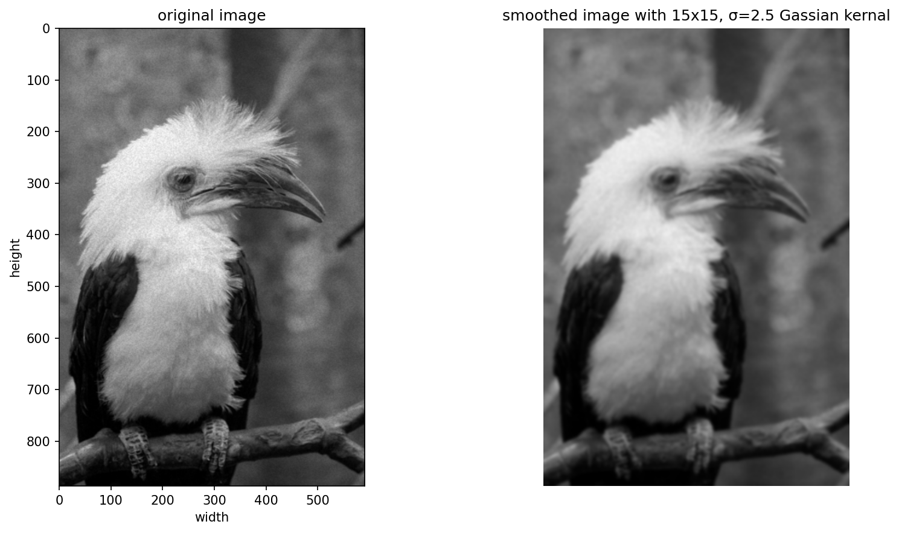
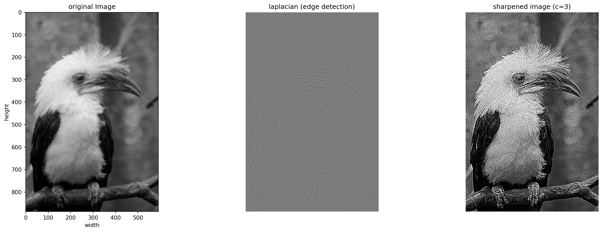
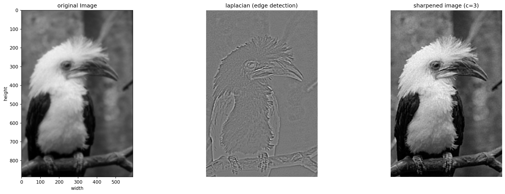

<font face="Times">

<center>

### 图像处理与可视化: Homework 3

陈皓阳 `23307130004@m.fudan.edu.cn`

</center>

<br>

#### [HW3-1] 编程实现图像域基于空间滤波器的（1）平滑操作、（2）锐化算法；并把算法应用与图片上，显示与原图的对比差别（备注：实现的代码不能调用某个算法库里面的函数实现平滑或锐化）。

##### (1) 平滑操作

* 原始图像 `3-1.png` 是一张经过噪音污染的照片，接下来分别展示使用平滑算法、锐化原始图像和锐化平滑后的图像



* `comparison_smooth_7_3-1.png` 是原始图像 `3-1.png`  和 使用 $15 \times 15, \sigma = 2.5$ 的高斯核进行平滑后的图像 `smooth_7_3-1` 的并排显示（数字 7 指的是核大小 15 减 1 的一半，选取核大小的时候遵循三个标准差准则，例如 7 是标准差 2.5 的 3 倍 7.5 的向下取整），平滑后的图像失去了很多细节，但好在噪音也一定程度上被去除了

##### (2) 锐化算法



* `comparison_sharpen_3_3-1.png` 是原始图像 `3-1.png`，对原始图像 `3-1.png` 进行拉普拉斯核滤波处理并进行归一化 和 最终锐化并进行截断的结果；可以看到，由于原图像受到噪音污染，拉普拉斯滤波处理后的图像无法明显地检测出边缘；最终，原始图像的噪声同边缘一样被锐化了



* `comparison_sharpen_3_smooth_7_3-1.png` 是原始图像的平滑处理 `smooth_7_3-1.png`，进行拉普拉斯核滤波处理并进行归一化 `lapacian_3_smooth_7_3-1.png` 和 最终锐化并进行截断 `sharpen_3_smooth_7_3-1.png` 的并排显示；结果显示，拉普拉斯核滤波处理检测出了更明显的边缘，锐化算法在经过平滑预处理的图像上也实现了较好的效果

```python
# HW3-1.py
import numpy as np
from PIL import Image
import os
import matplotlib.pyplot as plt
import time
import math

### (1) smooth
def spatial_filter_smooth_one_channel(N, sigma, channel_array):
    """
    Parameter:
        N: kernal size (2N+1)x(2N+1)
        sigma: standard devia
        channel_array: single channel array
    Return:
        smooth_channel_array: smoothed channel array with N padding
    """
    height, width = channel_array.shape
    kernel_size = 2 * N + 1
    
    # construct gaussion kernal
    kernel = np.zeros((kernel_size, kernel_size))
    for i in range(kernel_size):
        for j in range(kernel_size):
            x, y = i - N, j - N
            kernel[i, j] = np.exp(-(x**2 + y**2) / (2 * sigma**2))
    kernel /= kernel.sum()  
    
    # pad with edge's pixel
    padded = np.pad(channel_array, pad_width = N, mode = 'edge')
    smooth_channel_array = np.zeros((height, width))
    for i in range(kernel_size):
        for j in range(kernel_size):
            smooth_channel_array += kernel[i, j] * padded[i: i + height, j: j + width]
    
    return smooth_channel_array.astype(channel_array.dtype)

def spartial_filter_smooth(N, sigma, image_path, save=True):
    """
    Parameter:
        N: kernel radius
        sigma: gaussian sigma
        image_path
        save
    """
    img = Image.open(image_path)
    img_array = np.array(img)
    # if gray
    start_time = time.time()
    if len(img_array.shape) == 2:
        smooth_array = spatial_filter_smooth_one_channel(N, sigma, img_array)
    # if rgb
    else:
        smooth_array = np.zeros_like(img_array)
        for channel in range(img_array.shape[2]): 
            smooth_array[:, :, channel] = spatial_filter_smooth_one_channel(
                N, sigma, img_array[:, :, channel]
            )
    print(f"spartial filter smooth of {image_path}: {time.time() - start_time:.2f}s")
    # save 
    if save:
        image_dir = "image"
        file_name = os.path.basename(image_path)
        output_name = "smooth_" + str(N) + "_" + file_name
        save_path = os.path.join(image_dir, output_name)
        
        result_img = Image.fromarray(smooth_array)
        result_img.save(save_path)
    
    return smooth_array

### (2) sharpen
def sharpen_one_channel(c, channel_array):
    """
    Parameter:
        c: for the laplacian kernal defined here, c is a positive number
    sharpen one channel using Laplacian filter
    Return:
        sharpen_channel_array: sharpened channel array after trimming
        laplacian = normalized \nable^{2} f
    """
    height, width = channel_array.shape
    laplacian_kernel = np.array([
        [-1, -1, -1],
        [-1,  8, -1],
        [-1, -1, -1]
    ], dtype=np.float64)
    
    kernel_size = 3
    pad_width = kernel_size // 2
    padded_channel = np.pad(channel_array, pad_width = pad_width, mode = 'edge')
    
    # for actual sharpen: dont normalize laplacian and trim sharpened channel array
    laplacian = np.zeros((height, width))
    for i in range(kernel_size):
        for j in range(kernel_size):
            laplacian += laplacian_kernel[i, j] * padded_channel[i: i + height, j: j + width]
    
    sharpen_channel_array = channel_array + c * laplacian
    sharpen_channel_array = np.clip(sharpen_channel_array, 0, 255)

    # for demonstrate and comparison: normalize laplacian to [0, 255] for visualization
    laplacian_min = (-laplacian).min()
    laplacian_max = (-laplacian).max()
    if laplacian_max - laplacian_min > 0:
        normalized_laplacian = (-laplacian - laplacian_min) / (laplacian_max - laplacian_min) * 255
    else:
        normalized_laplacian = np.zeros_like(-laplacian)
    
    return sharpen_channel_array, normalized_laplacian

def spatial_filter_sharpen(c, image_path, save=True):
   
    img = Image.open(image_path)
    img_array = np.array(img)
    start_time = time.time()
    # if grey
    if len(img_array.shape) == 2:
        sharpen_array, laplacian_array = sharpen_one_channel(c, img_array)
    # if RGB
    else:
        sharpen_array = np.zeros_like(img_array)
        laplacian_array = np.zeros_like(img_array)
        for channel in range(img_array.shape[2]):  
            sharpen_array[:, :, channel], laplacian_array[:, :, channel] = sharpen_one_channel(
                c, img_array[:, :, channel]
            )
    print(f"spartial filter sharpen of {image_path}: {time.time() - start_time:.2f}s")
    # save
    if save:
        image_dir = "image"
        file_name = os.path.basename(image_path)
        # save sharpened image
        sharpen_name = "sharpen_" + str(c) + "_" + file_name
        sharpen_path = os.path.join(image_dir, sharpen_name)
        sharpen_img = Image.fromarray(sharpen_array.astype(np.uint8))
        sharpen_img.save(sharpen_path)
        # save laplacian image
        laplacian_name = "laplacian_" + str(c) + "_" + file_name
        laplacian_path = os.path.join(image_dir, laplacian_name)
        if len(laplacian_array.shape) == 3 and laplacian_array.shape[2] == 4:
            laplacian_array = laplacian_array[:, :, :3]
        laplacian_img = Image.fromarray(laplacian_array)
        laplacian_img.save(laplacian_path)
    
    return sharpen_array, laplacian_array

### plot
def smooth_comparison(image_path, N, sigma, save_original=True):

    img = Image.open(image_path)
    img_array = np.array(img)
    
    # smooth
    smooth_result = spartial_filter_smooth(N, sigma, image_path, save_original)
    # plot
    fig, axes = plt.subplots(1, 2, figsize=(12, 6))

    im1 = axes[0].imshow(img_array, cmap='gray' if len(img_array.shape) == 2 else None)
    axes[0].set_title('original image')
    axes[0].set_xlabel('width')
    axes[0].set_ylabel('height')
    axes[0].axis('on')

    im2 = axes[1].imshow(smooth_result.astype(np.uint8), cmap='gray' if len(img_array.shape) == 2 else None)
    axes[1].set_title(f'smoothed image with {2*N+1}x{2*N+1}, σ={sigma} Gassian kernal')
    axes[1].axis('off')
    
    plt.tight_layout()
    # save 
    image_dir = "image"
    file_name = os.path.basename(image_path)
    name, _ = os.path.splitext(file_name)
    plt.savefig(os.path.join(image_dir, f'comparison_smooth_{N}_{name}.png'), bbox_inches='tight', dpi=150)
    plt.close() 


def sharpen_comparison(image_path, c, save_original):

    img = Image.open(image_path)
    img_array = np.array(img)
    
    # sharpen
    sharpen_result, laplacian_result = spatial_filter_sharpen(c, image_path, save_original)
    # plot
    fig, axes = plt.subplots(1, 3, figsize=(18, 6))

    im1 = axes[0].imshow(img_array, cmap='gray' if len(img_array.shape) == 2 else None)
    axes[0].set_title('original Image')
    axes[0].set_xlabel('width')
    axes[0].set_ylabel('height')
    axes[0].axis('on')

    if len(laplacian_result.shape) == 3 and laplacian_result.shape[2] == 4:
        laplacian_result = laplacian_result[:, :, :3]  
    im2 = axes[1].imshow(laplacian_result, cmap='gray' if len(laplacian_result.shape) == 2 else None)
    axes[1].set_title(f'laplacian (edge detection)')
    axes[1].axis('off')
    
    # sharpened image
    im3 = axes[2].imshow(sharpen_result.astype(np.uint8), cmap='gray' if len(img_array.shape) == 2 else None)
    axes[2].set_title(f'sharpened image (c={c})')
    axes[2].axis('off')
    
    plt.tight_layout()
    # save
    image_dir = "image"
    file_name = os.path.basename(image_path)
    name, _ = os.path.splitext(file_name)
    plt.savefig(os.path.join(image_dir, f'comparison_sharpen_{c}_{name}.png'), bbox_inches='tight', dpi=150)
    plt.close()  


if __name__ == "__main__":
    # smooth
    sigma = 2.5
    N = math.floor(3 * sigma)
    # sharpen
    c = 3
    # result comparison
    image_path = os.path.join("image", "3-1.png")
    smooth_comparison(image_path, N , sigma, save_original = True)
    sharpen_comparison(image_path, c, save_original = False)
    smooth_image = os.path.join("image", f"smooth_{N}_3-1.png")
    sharpen_comparison(smooth_image, c, save_original = True)
```

* 直接在本目录下运行 `HW3-1.py`，处理过的图像将保存至本目录下的 `image` 文件夹中 

<br>

#### [HW3-2] 证明：

##### （1）证明冲击窜（impulse train）的傅里叶变换后的频域表达式也是一个冲击窜。

冲激串 $S_{\Delta T}(t) = \sum_{k=-\infty}^{\infty} \delta(t - k\Delta T)$ 是周期为 $\Delta T$ 的周期函数，可展开为傅里叶级数： 

$$S_{\Delta T}(t)=\sum_{n=-\infty}^{\infty}c_{n}e^{j\frac{2\pi n}{\Delta{T}}t}$$

其中 $c_{n}$ 为： $c_{n}=\frac{1}{\Delta T}\int_{-\Delta T/2}^{\Delta T/2} S_{\Delta T}(t) e^{-j\frac{2\pi n}{\Delta T}t}dt$

在一个周期 $[-\Delta T/2, \Delta T/2]$ 内，$S_{\Delta T}(t)$ 仅包含 $\delta(t)$，利用 $\delta$ 函数的取样特性：

$$c_{n} = \frac{1}{\Delta T}\int_{-\Delta T/2}^{\Delta T/2} \delta(t) e^{-j\frac{2\pi n}{\Delta T}t}dt = \frac{1}{\Delta T} e^{0} = \frac{1}{\Delta T}$$

故 $S_{\Delta T}(t) = \sum_{n=-\infty}^{\infty} \frac{1}{\Delta T} e^{j\frac{2\pi n}{\Delta T}t}$

$S(u) = \mathcal{F}\{S_{\Delta T}(t)\} = \mathcal{F}\left\{\sum_{n=-\infty}^{\infty} \frac{1}{\Delta T} e^{j\frac{2\pi n}{\Delta T}t}\right\} = \frac{1}{\Delta T} \sum_{n=-\infty}^{\infty} \mathcal{F}\left\{e^{j 2\pi \left(\frac{n}{\Delta T}\right) t}\right\} \quad (1)$

上式中的傅里叶变换较难计算，故转而计算 $\delta$ 冲激函数的傅里叶逆变换：$\mathcal{F}^{-1}\left\{\delta\left(\mu - \frac{n}{\Delta T}\right)\right\}$

$\mathcal{F}^{-1}\left\{\delta\left(\mu - \frac{n}{\Delta T}\right)\right\} = \int_{-\infty}^{\infty} \delta\left(\mu - \frac{n}{\Delta T}\right) e^{j 2\pi \mu t} d\mu = e^{j 2\pi \left(\frac{n}{\Delta T}\right) t}$

根据傅里叶变换的可逆性，$\mathcal{F}\left\{e^{j 2\pi \frac{n}{\Delta T} t}\right\} = \delta\left(\mu - \frac{n}{\Delta T}\right) \quad (2)$

将 (2) 代入 (1)：$S(\mu) = \frac{1}{\Delta T} \sum_{n=-\infty}^{\infty} \delta\left(\mu - \frac{n}{\Delta T}\right)$，即冲击窜的傅里叶变换后的频域表达式也是一个冲击窜

<br>

##### （2）证明实信号f(x)的离散频域变换结果是共轭对称的。

即证明，设 $f_n$ ($n=0, 1, \dots, M-1$) 为一维离散实信号，$f_n = f_n^*$，其离散傅里叶变换 (DFT) 为 $F_m$ ($m=0, 1, \dots, M-1$)，则 $F_m$ 是共轭对称的，即 $F_m^* = F_{M-m}$

$F_m = \sum_{n=0}^{M-1} f_n e^{-j \frac{2\pi mn}{M}}$，$F_m^* = \left( \sum_{n=0}^{M-1} f_n e^{-j \frac{2\pi mn}{M}} \right)^* = \sum_{n=0}^{M-1} f_n^* \left( e^{-j \frac{2\pi mn}{M}} \right)^*$

代入 $f_n^* = f_n$，$(e^{-j\theta})^* = e^{j\theta}$，故 $F_m^* = \sum_{n=0}^{M-1} f_n e^{j \frac{2\pi mn}{M}}$

进一步变换指数项 $e^{j \frac{2\pi mn}{M}} = \cos\left(\frac{2\pi mn}{M}\right) + j \sin\left(\frac{2\pi mn}{M}\right)$

利用三角函数的周期性：

$\cos\left(\frac{2\pi mn}{M}\right) = \cos\left(\frac{2\pi mn}{M} - 2\pi n\right) = \cos\left(2\pi n - \frac{2\pi mn}{M}\right) = \cos\left(\frac{2\pi (M-m)n}{M}\right)$

$\sin\left(\frac{2\pi mn}{M}\right) = \sin\left(\frac{2\pi mn}{M} - 2\pi n\right) = -\sin\left(2\pi n - \frac{2\pi mn}{M}\right) = -\sin\left(\frac{2\pi (M-m)n}{M}\right)$

代回指数项：$e^{j \frac{2\pi mn}{M}} = \cos\left(\frac{2\pi(M-m)n}{M}\right) - j \sin\left(\frac{2\pi(M-m)n}{M}\right) = e^{-j \frac{2\pi (M-m)n}{M}}$

代回 $F_m^* = \sum_{n=0}^{M-1} f_n e^{-j \frac{2\pi (M-m)n}{M}}$，而 $F_{M-m} = \sum_{n=0}^{M-1} f_n e^{-j \frac{2\pi (M-m)n}{M}}$

故 $F_m^* = F_{M-m}$

<br>

##### （3）证明二维变量的离散频域/傅里叶变换的卷积定理。

设 $f(x,y)$ 和 $h(x,y)$ 为 $M \times N$ 的二维离散信号，先给出一些基本公式：

* 二维离散傅里叶变换:

$F(u,v)=\sum_{x=0}^{M-1}\sum_{y=0}^{N-1}f(x,y)e^{-j2\pi(\frac{ux}{M}+\frac{vy}{N})}$

* 二维离散傅里叶逆变换: 

$f(x,y)=\frac{1}{MN}\sum_{u=0}^{M-1}\sum_{v=0}^{N-1}F(u,v)e^{j2\pi(\frac{ux}{M}+\frac{vy}{N})}$

* 二维循环卷积：

$f(x,y)*h(x,y) = \sum_{m=0}^{M-1}\sum_{n=0}^{N-1}f(m,n)h(x-m,y-n)$


① 证明：$f(x,y)*h(x,y) \iff F(u,v)H(u,v)$，$\mathcal{F}\{f(x,y)*h(x,y)\} = F(u,v)H(u,v)$

$\mathcal{F}\{f(x,y)*h(x,y)\} = \sum_{x=0}^{M-1}\sum_{y=0}^{N-1} \left( f(x,y)*h(x,y) \right) e^{-j2\pi(\frac{ux}{M}+\frac{vy}{N})}$

$= \sum_{x=0}^{M-1}\sum_{y=0}^{N-1} \left( \sum_{m=0}^{M-1}\sum_{n=0}^{N-1}f(m,n)h(x-m,y-n) \right) e^{-j2\pi(\frac{ux}{M}+\frac{vy}{N})}$

交换求和顺序：

$= \sum_{m=0}^{M-1}\sum_{n=0}^{N-1} f(m,n) \left( \sum_{x=0}^{M-1}\sum_{y=0}^{N-1} h(x-m,y-n) e^{-j2\pi(\frac{ux}{M}+\frac{vy}{N})} \right)$

$= \sum_{m=0}^{M-1}\sum_{n=0}^{N-1} f(m,n) \left( \sum_{p=0}^{M-1}\sum_{q=0}^{N-1} h(x-m,y-n) e^{-j2\pi(\frac{u(x-m)}{M}+\frac{v(y-n)}{N})} e^{-j2\pi(\frac{um}{M} + \frac{vn}{N})} \right)$

$= \sum_{m=0}^{M-1}\sum_{n=0}^{N-1} f(m,n) e^{-j2\pi(\frac{um}{M} + \frac{vn}{N})} \left( \sum_{x=0}^{M-1}\sum_{y=0}^{N-1} h(x-m,y-n) e^{-j2\pi(\frac{u(x-m)}{M}+\frac{v(y-n)}{N})} \right)$

令 $p = x-m$，$q = y-n$，由于假定的周期性，求和标号可以平移到原来的一个周期内：

$= \sum_{m=0}^{M-1}\sum_{n=0}^{N-1} f(m,n) e^{-j2\pi(\frac{um}{M} + \frac{vn}{N})} \left( \sum_{p=0}^{M-1}\sum_{q=0}^{N-1} h(p,q) e^{-j2\pi(\frac{up}{M}+\frac{vq}{N})} \right)$

括号内是二维离散傅里叶变换：

$= \sum_{m=0}^{M-1}\sum_{n=0}^{N-1} f(m,n) e^{-j2\pi(\frac{um}{M} + \frac{vn}{N})} H(u,v)$

$= H(u,v) \left( \sum_{m=0}^{M-1}\sum_{n=0}^{N-1} f(m,n) e^{-j2\pi(\frac{um}{M} + \frac{vn}{N})} \right)$

$= F(u,v)H(u,v)$


② 证明：$f(x,y)h(x,y) \iff \frac{1}{MN}F(u,v)*H(u,v)$，$\mathcal{F}\{f(x,y)h(x,y)\} = \frac{1}{MN}(F*H)(u,v)$

$\mathcal{F}\{f(x,y)h(x,y)\} = \sum_{x=0}^{M-1}\sum_{y=0}^{N-1} f(x,y)h(x,y) e^{-j2\pi(\frac{ux}{M}+\frac{vy}{N})}$

将 $h(x,y)$ 用二维离散傅里叶逆变换表达 (为避免混淆，使用 $m, n$ 作为求和变量)：

$= \sum_{x=0}^{M-1}\sum_{y=0}^{N-1} f(x,y) \left( \frac{1}{MN}\sum_{m=0}^{M-1}\sum_{n=0}^{N-1}H(m,n)e^{j2\pi(\frac{mx}{M}+\frac{ny}{N})} \right) e^{-j2\pi(\frac{ux}{M}+\frac{vy}{N})}$

交换求和顺序，提取 $\frac{1}{MN}$：

$= \frac{1}{MN} \sum_{m=0}^{M-1}\sum_{n=0}^{N-1} H(m,n) \left( \sum_{x=0}^{M-1}\sum_{y=0}^{N-1} f(x,y) e^{j2\pi(\frac{mx}{M}+\frac{ny}{N})} e^{-j2\pi(\frac{ux}{M}+\frac{vy}{N})} \right)$

$= \frac{1}{MN} \sum_{m=0}^{M-1}\sum_{n=0}^{N-1} H(m,n) \left( \sum_{x=0}^{M-1}\sum_{y=0}^{N-1} f(x,y) e^{-j2\pi \left( \frac{(u-m)x}{M}+\frac{(v-n)y}{N} \right)} \right)$

括号内是二维离散傅里叶变换的表达式：

$= \frac{1}{MN} \sum_{m=0}^{M-1}\sum_{n=0}^{N-1} H(m,n) F(u-m, v-n)$

$= \frac{1}{MN} (H*F)(u,v) = \frac{1}{MN} (F*H)(u,v)$

<br>