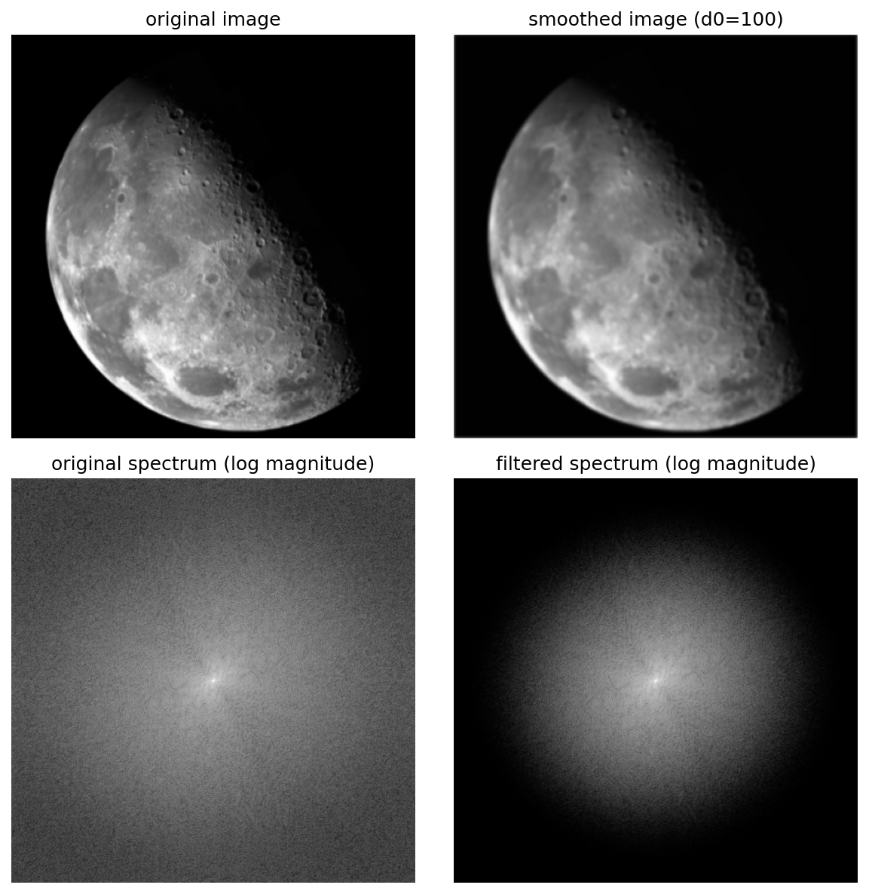
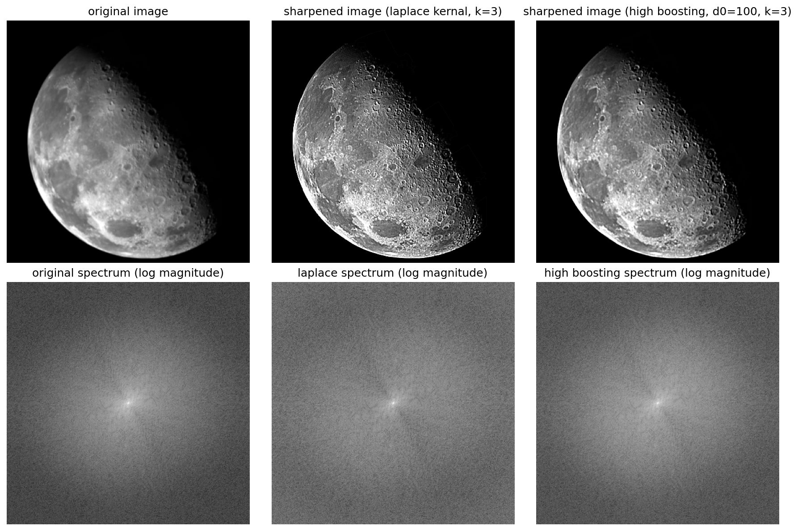
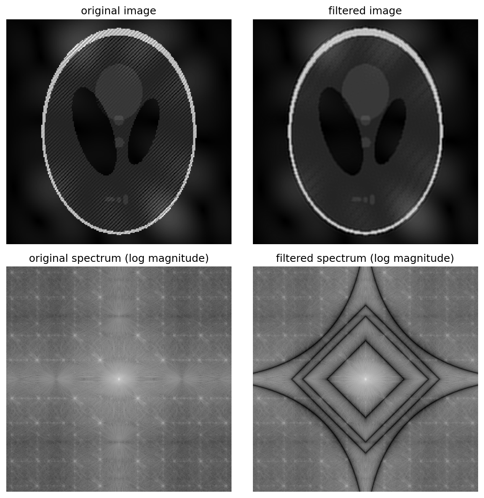

<font face="Times">

<center>

### 图像处理与可视化: Homework 4

陈皓阳 `23307130004@m.fudan.edu.cn`

</center>

<br>

#### [HW4-1] 编程实现基于课件中频率域滤波5步骤的：

1. **填充 (Padding)**

    - 给定大小为 $M\times N$ 的图像 $f(x,y)$，填充 (padding) 图像为 $P\times Q$ (通常 $P \ge 2M, Q \ge 2N$)，得到 $f_p(x,y)$
    - 这一步是为了防止缠绕错误

2. **中心化 (Centering) 与 DFT**

    - 用 $(-1)^{x+y}$ 乘以填充后的 $f_p(x,y)$
    - $f_p(x,y)(-1)^{x+y}$
    - 这一步是为了将频域的原点 $(0,0)$ 从图像的角落平移到中心 $(P/2, Q/2)$ (根据 $f(x,y)(-1)^{x+y}\Leftrightarrow F(u-P/2,v-Q/2)$)
    - 对中心化后的图像计算 DFT，得到中心化的傅里叶变换 $F(u,v)$

3. **滤波 (Filtering)**

    - 生成一个大小为 $P\times Q$、实对称且中心化的滤波函数 $H(u,v)$
    - 在频域中，根据卷积定理 $f*h \iff FH$，将图像的频谱 $F(u,v)$ 与滤波器 $H(u,v)$ 逐点相乘
    - $G(u,v)=H(u,v)F(u,v)$

4. **反变换与反中心化**
   
    - 计算 $G(u,v)$ 的傅里叶逆变换 (IDFT)，得到 $g_p'(x,y) = \mathcal{F}^{-1}[G(u,v)]$
    - 再次乘以 $(-1)^{x+y}$ 来撤销步骤 2 中的中心化操作
    - $g_p(x,y) = \mathcal{F}^{-1}[G(u,v)] (-1)^{x+y}$
    - 由于输入 $f(x,y)$ 是实函数，计算中可能产生微小的虚部，因此取其实部
    - $g_p(x,y) = \{\text{real}[\mathcal{F}^{-1}[G(u,v)]]\}(-1)^{x+y}$

5. **提取 (Cropping)**

    - 从 $g_p(x,y)$ 的左上象限提取出 $M\times N$ 大小的图像
    - 这对应于步骤 1 中填充的逆操作，得到最终的滤波后图像 $g(x,y)$

<div STYLE="page-break-after: always;"></div>

##### (1) 低通平滑操作，并把算法应用与图片上，显示原图的频谱图、频域操作结果的频谱图，以及操作结果；



* 在频域上使用高斯低通滤波器，调整截止频率 `d0` 可以调整亮斑大小

<br>

```python
import numpy as np
from PIL import Image
import os
import matplotlib.pyplot as plt

def frequency_filter_smooth_one_channel(d0, channel_array):
    """
    Parameter:
        d0: cutoff frequency for Gaussian lowpass filter
        channel_array: single channel array
    Return:
        smooth_channel_array: smoothed channel array
        original_spectrum: log-magnitude of original frequency domain
        filtered_spectrum: log-magnitude of filtered frequency domain
    """
    channel = channel_array.astype(np.float32)
    M, N = channel.shape

    # Step 1: Padding
    P, Q = 2 * M, 2 * N
    fp = np.zeros((P, Q), dtype=np.float32)
    fp[0:M, 0:N] = channel

    # Step 2: Centering and DFT
    x, y = np.arange(P), np.arange(Q)
    X, Y = np.meshgrid(x, y, indexing='ij')
    center_matrix = (-1) ** (X + Y)
    fp_centered = fp * center_matrix
    F = np.fft.fft2(fp_centered)
    original_spectrum = np.log(np.abs(F) + 1)

    # Step 3: Filtering
    u, v = np.arange(P), np.arange(Q)
    U, V = np.meshgrid(u, v, indexing='ij')
    center_u, center_v = P / 2, Q / 2
    distance_square = (U - center_u) ** 2 + (V - center_v) ** 2
    H = np.exp(- distance_square / (2 * d0 ** 2))
    G = F * H
    filtered_spectrum = np.log(np.abs(G) + 1)

    # Step 4: Inverse transform and de-centering
    gp_prim = np.fft.ifft2(G)
    gp = np.real(gp_prim * center_matrix)

    # Step 5: Cropping
    g = np.clip(gp[0: M, 0: N], 0, 255)
    smooth_channel_array = g.astype(channel_array.dtype)

    return smooth_channel_array, original_spectrum, filtered_spectrum

def frequency_filter_smooth(image_path, d0, save=True, plot=True):
    """
    Parameter:
        image_path: path of image to smooth
        d0: cutoff frequency for Gaussian lowpass filter
        save: save smoothed image and spectrum comparison
        plot: plot comparison figure
    Return:
        smooth_image_array: smoothed image array
    """
    image = Image.open(image_path)
    image_array = np.array(image)

    if image_array.ndim == 2:
        smooth_image_array, original_spectrum, filtered_spectrum = frequency_filter_smooth_one_channel(d0, image_array)
    else:
        smooth_image_array = np.zeros_like(image_array)
        for channel in range(image_array.shape[2]):
            smooth_image_array[:, :, channel], _, _ = frequency_filter_smooth_one_channel(d0, image_array[:, :, channel])
            if channel == 0:
                _, original_spectrum, filtered_spectrum = frequency_filter_smooth_one_channel(d0, image_array[:, :, channel])

    image_dir = "image"
    file_name = os.path.basename(image_path)

    if save:
        output_name = f"smooth_{d0}_{file_name}"
        save_path = os.path.join(image_dir, output_name)
        output_image = Image.fromarray(smooth_image_array.astype(np.uint8))
        output_image.save(save_path)

    if plot:
        fig, axes = plt.subplots(2, 2, figsize=(8, 8))

        axes[0, 0].imshow(image_array, cmap='gray' if image_array.ndim == 2 else None)
        axes[0, 0].set_title('original image')
        axes[0, 0].axis('off')

        axes[0, 1].imshow(smooth_image_array.astype(np.uint8), cmap='gray' if image_array.ndim == 2 else None)
        axes[0, 1].set_title(f'smoothed image (d0={d0})')
        axes[0, 1].axis('off')

        axes[1, 0].imshow(original_spectrum, cmap='gray')
        axes[1, 0].set_title('original spectrum (log magnitude)')
        axes[1, 0].axis('off')

        axes[1, 1].imshow(filtered_spectrum, cmap='gray')
        axes[1, 1].set_title('filtered spectrum (log magnitude)')
        axes[1, 1].axis('off')

        plt.tight_layout()
        plt.savefig(os.path.join(image_dir, f"comparison_smooth_{d0}_{file_name}"), bbox_inches='tight', dpi=150)
        plt.close()

    return smooth_image_array

if __name__ == "__main__":

    d0 = 100
    image_path = os.path.join("image", "4-1.png")
    frequency_filter_smooth(image_path, d0, save=True, plot=True)
```

<div STYLE="page-break-after: always;"></div>

##### (2) 实现至少一种图像的锐化操作，该操作是基于频域操作的。



* 分别使用基于频域拉普拉斯算子的频域滤波器和 high-boosting 方法的频域滤波器，在原图像的频域上三倍强化高频细节

* 拉普拉斯算子的频域推导

  对 $\nabla^{2}f$ 取傅里叶变换，并应用 1D 导数结论 $\mathcal{F}\{\frac{\partial f}{\partial x}\} = j2\pi u F(u)$

  $\mathcal{F}\{\frac{\partial^{2}f}{\partial x^{2}}\} = j2\pi u \mathcal{F}\{\frac{\partial f}{\partial x}\} = (j2\pi u)(j2\pi u)F(u,v) = -4\pi^2 u^2 F(u,v)$

  $\mathcal{F}\{\frac{\partial^{2}f}{\partial y^{2}}\} = j2\pi v \mathcal{F}\{\frac{\partial f}{\partial y}\} = (j2\pi v)(j2\pi v)F(u,v) = -4\pi^2 v^2 F(u,v)$

  $\mathcal{F}\{\nabla^{2}f(x,y)\} = \mathcal{F}\{\frac{\partial^{2}f}{\partial x^{2}} + \frac{\partial^{2}f}{\partial y^{2}}\} = (-4\pi^2 u^2 - 4\pi^2 v^2) F(u,v)$

  因此，拉普拉斯滤波器的频域表达式为：$H_{Lap}(u,v) = -4\pi^{2}(u^{2}+v^{2})$ 

  锐化操作可以直接在频域通过以下滤波器实现

  $$g(x, y) = \mathcal{F}^{-1}\{[1 - cH_{Lap}(u, v)]F(u, v)\}$$

* high-boosting 方法 

  获取低频分量，使用低通滤波器对图像进行平滑处理
  $$f_{LP}(x, y) = \mathcal{F}^{-1}\{H_{LP}(u, v)F(u, v)\}$$

  获取高频掩膜，用原图减去平滑后的低频图像，得到包含边缘和细节的高频掩膜
  $$g_{mask}(x, y) = f(x, y) - f_{LP}(x, y)$$

  $$g_{mask}(x, y) = \mathcal{F}^{-1}\{(1 - H_{LP}(u, v))F(u, v)\} = \mathcal{F}^{-1}\{H_{HP}(u, v)F(u, v)\}$$

  加权增强与合成
  $$g(x, y) = f(x, y) + k \cdot g_{mask}(x, y)$$

  整个过程可以合并为一个频域滤波器表达式
  $$g(x, y) = \mathcal{F}^{-1}\{[1 + k(1 - H_{LP}(u, v))]F(u, v)\}$$

<br>

```python
import numpy as np
from PIL import Image
import os
import matplotlib.pyplot as plt

def convert_to_gray(image_array):

    if len(image_array.shape) == 2:
        return image_array
    elif len(image_array.shape) == 3:
        if image_array.shape[2] == 3:
            gray_array = np.dot(image_array[..., :3], [0.299, 0.587, 0.114])
        elif image_array.shape[2] == 4:
            gray_array = np.dot(image_array[..., :3], [0.299, 0.587, 0.114])
        else:
            gray_array = image_array[:, :, 0]
        return gray_array.astype(image_array.dtype)

def frequency_filter_sharpen(image_path, k, d0, save = True, plot = True):
    r"""
    Parameter:
        k: Laplace - $g(x, y) = \mathcal{F}^{-1}\{[1 + kH_{Lap}(u, v)]F(u, v)\}$
           High Boosting - $g(x, y) = \mathcal{F}^{-1}\{[1 + kH_{HP}(u, v)]F(u, v)\}$
        d0: cutoff frequency for Gaussian lowpass filter (1 - Gaussian lowpass filter = high pass filter) 
        image_path:
    Return:
        sharpened_laplace_array: use frequency kernal $H_{Lap}(u,v) = -4\pi^{2}(u^{2}+v^{2})$         
        sharpened_highboosting_array: use frequency kernal $1 + k(1 - H_{LP}(u, v))$, $H_{LP}(u, v)$ is Gaussian kernal
    """
    image = Image.open(image_path)
    image_array = np.array(image)
    image_array = convert_to_gray(image_array)
    M, N = image_array.shape

    # Step 1: Padding
    P, Q = 2 * M, 2 * N
    fp = np.zeros((P, Q), dtype=np.float32)
    fp[0: M, 0: N] = image_array.astype(np.float32)

    # Step 2: Centering and DFT
    x, y = np.arange(P), np.arange(Q)
    X, Y = np.meshgrid(x, y, indexing='ij')
    center_matrix = (-1) ** (X + Y)
    fp_centered = fp * center_matrix
    F = np.fft.fft2(fp_centered)
    original_spectrum = np.log(np.abs(F) + 1)

    # Step 3: Filtering
    u, v = np.arange(P), np.arange(Q)
    U, V = np.meshgrid(u, v, indexing='ij')
    center_u, center_v = P / 2, Q / 2
    
    # laplace kernal: normalize frequency coordinates
    U_norm = (U - center_u) / P
    V_norm = (V - center_v) / Q
    distance_square_norm = U_norm ** 2 + V_norm ** 2
    H_laplace = -4 * np.pi ** 2 * distance_square_norm
    G_laplace = F * (1 - k * H_laplace)
    laplace_spectrum = np.log(np.abs(G_laplace) + 1)

    # high boosting
    distance_square = (U - center_u) ** 2 + (V - center_v) ** 2
    H_highboosting = 1 - np.exp(- distance_square / (2 * d0 ** 2))
    G_highboosting = F * (1 + k * H_highboosting)
    highboosting_spectrum = np.log(np.abs(G_highboosting) + 1)

    # Step 4 method 1: Inverse transform and de-centering for Laplace
    original_gp_laplace = np.fft.ifft2(G_laplace)
    gp_laplace = np.real(original_gp_laplace * center_matrix)

    # Step 4 method 2: Inverse transform and de-centering for High Boosting
    original_gp_highboosting = np.fft.ifft2(G_highboosting)
    gp_highboosting = np.real(original_gp_highboosting * center_matrix)

    # Step 5: Cropping
    g_laplace = np.clip(gp_laplace[0: M, 0: N], 0, 255)
    sharpen_laplace_array = g_laplace.astype(image_array.dtype)
    
    g_highboosting = np.clip(gp_highboosting[0: M, 0: N], 0, 255)
    sharpen_highboosting_array = g_highboosting.astype(image_array.dtype)

    image_dir = "image"
    file_name = os.path.basename(image_path)

    if save:
        output_name_laplace = f"sharpen_laplace_{k}_{file_name}"
        save_path_laplace = os.path.join(image_dir, output_name_laplace)
        output_image_laplace = Image.fromarray(sharpen_laplace_array)
        output_image_laplace.save(save_path_laplace)
        
        output_name_highboosting = f"sharpen_highboosting_{d0}_{k}_{file_name}"
        save_path_highboosting = os.path.join(image_dir, output_name_highboosting)
        output_image_highboosting = Image.fromarray(sharpen_highboosting_array)
        output_image_highboosting.save(save_path_highboosting)

    if plot:

        fig, axes = plt.subplots(2, 3, figsize=(12, 8))

        axes[0, 0].imshow(image_array, cmap='gray')
        axes[0, 0].set_title('original image')
        axes[0, 0].axis('off')

        axes[0, 1].imshow(sharpen_laplace_array, cmap='gray')
        axes[0, 1].set_title(f'sharpened image (laplace kernal, k={k})')
        axes[0, 1].axis('off')

        axes[0, 2].imshow(sharpen_highboosting_array, cmap='gray')
        axes[0, 2].set_title(f'sharpened image (high boosting, d0={d0}, k={k})')
        axes[0, 2].axis('off')

        axes[1, 0].imshow(original_spectrum, cmap='gray')
        axes[1, 0].set_title('original spectrum (log magnitude)')
        axes[1, 0].axis('off')

        axes[1, 1].imshow(laplace_spectrum, cmap='gray')
        axes[1, 1].set_title('laplace spectrum (log magnitude)')
        axes[1, 1].axis('off')

        axes[1, 2].imshow(highboosting_spectrum, cmap='gray')
        axes[1, 2].set_title('high boosting spectrum (log magnitude)')
        axes[1, 2].axis('off')

        plt.tight_layout()
        plt.savefig(os.path.join(image_dir, f"comparison_sharpen_{k}_{file_name}"), bbox_inches='tight', dpi=150)
        plt.close()

    return sharpen_laplace_array, sharpen_highboosting_array


if __name__ == "__main__":

    k = 3
    d0 = 100
    image_path = os.path.join("image", "4-1.png")
    frequency_filter_sharpen(image_path, k, d0, save=False, plot=True)
```

<br>

<div STYLE="page-break-after: always;"></div>

#### [HW4-2] 编程实现基于频域的选择滤波器方法，去除大脑CT体膜图像（Shepp-Logan）中的条纹；或自己设计一个有周期噪声的图片，并用频域选择滤波器去除噪声。备注：图像的时空-频域变换（即离散频域/傅里叶变换和逆变换）可以调用库函数。




* 大部分摩尔纹明显减轻了，白色花瓣及其上的摩尔纹比较难去除

* 本方法通过组合多个高斯带阻滤波器来去除图像中的周期性噪声

  单个带阻滤波器：使用高斯带阻滤波器，其传递函数为 $H = 1 - \exp\left(-\left[\frac{D^2 - C_0^2}{D \cdot W}\right]^2\right)$，其中 $D$ 为频率点到频谱中心的距离，使用 $p$-范数：$D = (|U-u_0|^p + |V-v_0|^p)^{1/p}$，参数 $C_0$ 控制阻带中心频率，$W$ 控制阻带带宽，$p$ 控制距离度量的形状（$p=1$ 为曼哈顿距离，$p=2$ 为欧氏距离，$p<1$ 可产生更尖锐的阻带形状）

  多滤波器的组合方式：将多个带阻滤波器逐点相乘，即 $H_{combined} = \prod_{i=1}^{n} H_i$；各个滤波器参数单独设置，互不干扰

<br>

```python
import numpy as np
from PIL import Image
import os
import matplotlib.pyplot as plt

def show_spectrum(image_path, plot=True):
    """
    Return:
        image_array: original image array 
        F: frequency domain 
    """
    image = Image.open(image_path)
    image_array = np.array(image)
    
    if len(image_array.shape) == 3:
        channel_array = image_array[:, :, 0] 
    else:
        channel_array = image_array
    M, N = channel_array.shape
    
    # Step 1: Padding
    P, Q = 2 * M, 2 * N
    fp = np.zeros((P, Q), dtype=np.float32)
    fp[0: M, 0: N] = channel_array.astype(np.float32)
    
    # Step 2: Centering and DFT
    x, y = np.arange(P), np.arange(Q)
    X, Y = np.meshgrid(x, y, indexing='ij')
    center_matrix = (-1) ** (X + Y)
    fp_centered = fp * center_matrix
    F = np.fft.fft2(fp_centered)
    spectrum = np.log(np.abs(F) + 1)
    
    image_dir = "image"
    if not os.path.exists(image_dir):
        os.makedirs(image_dir)
    file_name = os.path.basename(image_path)
    
    if plot:
        fig, axes = plt.subplots(1, 2, figsize=(10, 6))
        
        axes[0].imshow(channel_array, cmap='gray')
        axes[0].set_title('original image')
        axes[0].axis('off')
        
        axes[1].imshow(spectrum, cmap='gray')
        axes[1].set_title('frequency spectrum (log magnitude)')
        axes[1].axis('off')
        
        plt.tight_layout()
        plt.savefig(os.path.join(image_dir, f"spectrum_{file_name}"), bbox_inches='tight', dpi=150)
        plt.close()
    
    return channel_array, F

def gaussian_highpass_filter_pnorm(channel_array, F, num, C0, W, p, save=True, plot=True):
    """
    Parameter:
        channel_array: original image array from show_spectrum
        F: frequency domain from show_spectrum
        num: number of filters
        C0: list of center frequency parameters for each filter
        W: list of bandwidth parameters for each filter
        p: list of p-norm parameters for distance calculation for each filter
    Return:
        filtered_array: filtered image array
    """
    M, N = channel_array.shape
    P, Q = 2 * M, 2 * N

    x, y = np.arange(P), np.arange(Q)
    X, Y = np.meshgrid(x, y, indexing='ij')
    center_matrix = (-1) ** (X + Y)
    
    original_spectrum = np.log(np.abs(F) + 1)
    
    # Step 3: Filtering with p-norm
    u, v = np.arange(P), np.arange(Q)
    U, V = np.meshgrid(u, v, indexing='ij')
    center_u, center_v = P / 2, Q / 2
    
    # Initialize combined filter H
    H_combined = np.ones((P, Q), dtype=np.float64)
    
    # Apply each filter and combine by multiplication
    for i in range(num):
        # p-norm distance: D = (|U-center_u|^p + |V-center_v|^p)^(1/p)
        U_diff = np.abs(U - center_u)
        V_diff = np.abs(V - center_v)
        D = (U_diff ** p[i] + V_diff ** p[i]) ** (1.0 / p[i])
        
        # Gaussian band-reject filter: H = 1 - exp(-[ (D^2 - C0^2) / (D*W) ]^2)
        epsilon = 1e-10
        D_safe = np.where(D < epsilon, epsilon, D)
        D_square = D ** 2
        ratio = (D_square - C0[i] ** 2) / (D_safe * W[i])
        H = 1.0 - np.exp(-(ratio ** 2))
        
        # Multiply filters together
        H_combined = H_combined * H
    
    G = F * H_combined
    filtered_spectrum = np.log(np.abs(G) + 1)
    
    # Step 4: Inverse transform and de-centering
    gp_prim = np.fft.ifft2(G)
    gp = np.real(gp_prim * center_matrix)
    
    # Step 5: Cropping
    g = np.clip(gp[0: M, 0: N], 0, 255)
    filtered_array = g.astype(channel_array.dtype)
    
    image_dir = "image"
    
    if save:
        output_name = f"filter_4-2.png"
        save_path = os.path.join(image_dir, output_name)
        output_image = Image.fromarray(filtered_array)
        output_image.save(save_path)
    
    if plot:
        fig, axes = plt.subplots(2, 2, figsize=(8, 8))
        
        axes[0, 0].imshow(channel_array, cmap='gray')
        axes[0, 0].set_title('original image')
        axes[0, 0].axis('off')
        
        axes[0, 1].imshow(filtered_array, cmap='gray')
        axes[0, 1].set_title(f'filtered image')
        axes[0, 1].axis('off')
        
        axes[1, 0].imshow(original_spectrum, cmap='gray')
        axes[1, 0].set_title('original spectrum (log magnitude)')
        axes[1, 0].axis('off')
        
        axes[1, 1].imshow(filtered_spectrum, cmap='gray')
        axes[1, 1].set_title('filtered spectrum (log magnitude)')
        axes[1, 1].axis('off')
        
        plt.tight_layout()
        plt.savefig(os.path.join(image_dir, f"comparison_filter_4-2.png"), bbox_inches='tight', dpi=150)
        plt.close()
    
    return filtered_array

if __name__ == "__main__":

    num = 4
    C0 = [245, 400, 470, 1080]
    W = [200, 100, 100, 300]
    p = [1.0, 1.0, 1.0, 0.50]
    image_path = os.path.join("image", "4-2.png")

    channel_array, F = show_spectrum(image_path, plot=True)
    filtered_array = gaussian_highpass_filter_pnorm(channel_array, F, num, C0, W, p, save=True, plot=True)
```

<br>