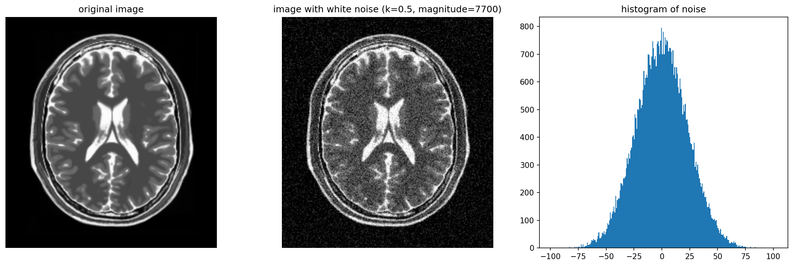
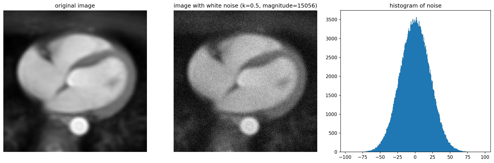
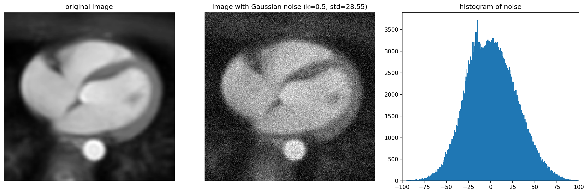
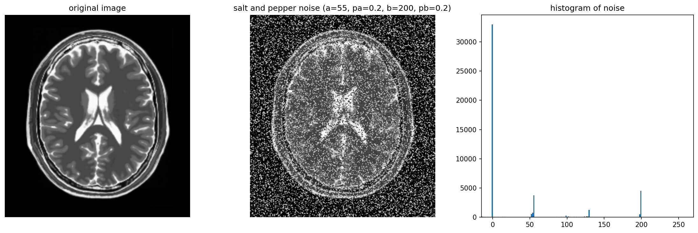
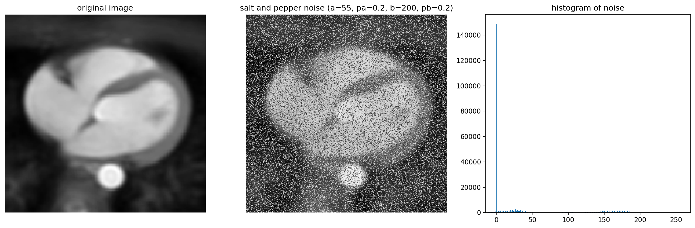
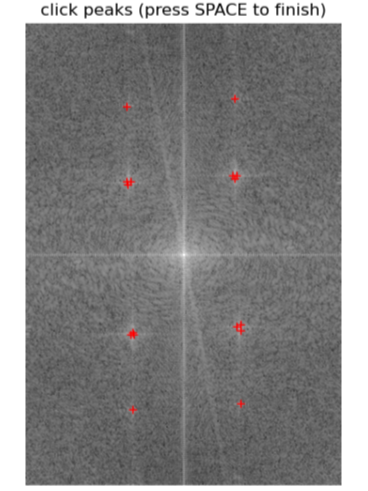
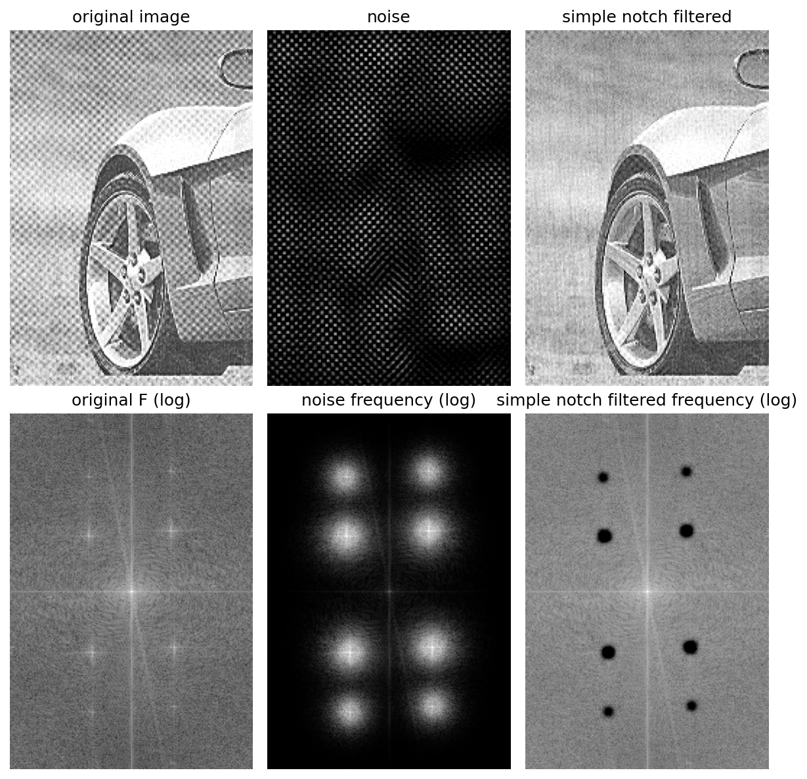
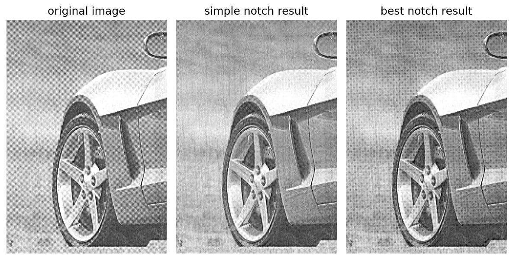
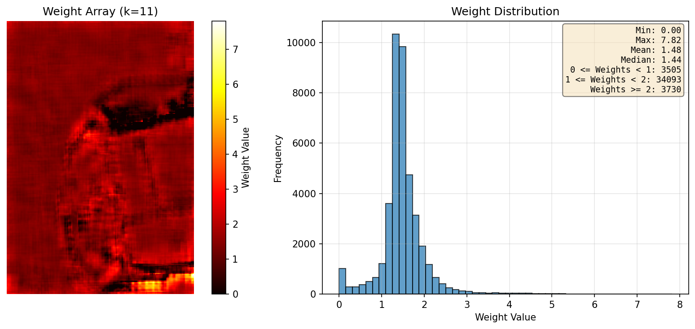

<font face="Times">

<center>

### 图像处理与可视化: Homework 5

陈皓阳 `23307130004@m.fudan.edu.cn`

</center>

<br>

#### [HW5-1] 实现噪声的生成（不可以调用别的库实现的函数）针对对大脑、心脏图像（或其他多类图像），生成以下两种不同类型、不同强度的噪声，并使用生成的噪声污染图像，对比展示噪声污染前后的图像：

##### (1) 生成白噪声



* `white_noise_brain.png` 是 原图像 `brain.png`，受白噪声污染的图像 和 噪音直方图 的并列展示



* `white_noise_heart.png` 是 原图像 `heart.png`，受白噪声污染的图像 和 噪音直方图 的并列展示

* 频域中构造的白噪声为 $N(u,v)=A\mathrm{e}^{\mathrm{i}\phi(u,v)}$，其中 $\phi(u,v)\sim\text{Uniform}[0,2\pi)$，幅值 $A = k \times sigma \times \sqrt{MN}$，$k$ 是我们控制的参数，$sigma$ 是原图像时空域的标准差，$MN$ 是像素个数

* 以下是时空域作差得到的噪声的统计信息，直观上噪声的分布是高斯分布，均值为 0，标准差和 $k \times sigma$ 在一个数量级上

```
image\brain.png
practical noise mean = 0.11
practical noise std  = 23.22
k * sigma(original image) = 32.94

image\heart.png
practical noise mean = -0.06
practical noise std  = 21.39
k * sigma(original image) = 30.29
```

* 理论上的解释是：频域上噪声的期望为 $\mathbb{E}[N(u,v)]=0$，根据傅里叶逆变换，某个空间位置 $(x,y)$ 的时空域噪声为：

$$n(x,y)=\frac{1}{MN}\sum_{u,v}N(u,v)\mathrm{e}^{\mathrm{i}\phi_{x,y}(u,v)}$$

这是很多个独立零均值复随机变量的线性组合，由中心极限定理，$n(x,y)$ 在空间域中近似服从均值为 0 的高斯分布；又因为我们在频域中将噪声模长设置为 $A=k\sigma\sqrt{MN}$，求和的标准差为 $k \sigma MN$，由于逆变换的 $1 / MN$ 缩放，空间域噪声的标准差规模约为 $k\sigma$

<br>

```python
import numpy as np
from PIL import Image
import os
import matplotlib.pyplot as plt

def white_noise(image_path, k, plot=True):
    """
    Parameter:
        k: the magnitude of white noise is (k * sigma * sqrt(MN))
    Return:
        noisy_image_clipped: noise-added and clipped image array
        noise_array: noise array
    """
    image = Image.open(image_path).convert('L')
    image_array = np.array(image).astype(np.float32)
    M, N = image_array.shape

    F = np.fft.fft2(image_array)
    # construct white noise: constant magnitude + uniform phase
    phase = 2 * np.pi * np.random.uniform(0, 1, (M, N))
    sigma = image_array.std()
    noise_magnitude = k * sigma * np.sqrt(M * N)
    noise_F = noise_magnitude * (np.cos(phase) + 1j * np.sin(phase))
    # add frequency domain
    F_noisy = F + noise_F
    noisy_image_complex = np.fft.ifft2(F_noisy)
    noisy_image = np.real(noisy_image_complex)

    # noise-added image array, clip
    noisy_image_clipped = np.clip(noisy_image, 0, 255).astype(np.uint8)
    # noise array
    noise_array = noisy_image - image_array

    # empirical v.s. theoretical
    noise_mean = float(noise_array.mean())
    noise_std = float(noise_array.std())
    print(image_path)
    print(f"practical noise mean = {noise_mean:.2f}")
    print(f"practical noise std  = {noise_std:.2f}")
    print(f"k * sigma(original image) = {k * sigma:.2f}" + "\n")

    image_dir = "image"
    file_name = os.path.basename(image_path)

    if plot:
        fig, axes = plt.subplots(1, 3, figsize=(15, 5))

        # original
        axes[0].imshow(image_array, cmap='gray')
        axes[0].set_title('original image')
        axes[0].axis('off')
        # add white noise
        axes[1].imshow(noisy_image_clipped, cmap='gray')
        axes[1].set_title(f'image with white noise (k={k}, magnitude={noise_magnitude:.0f})')
        axes[1].axis('off')
        # noise histogram
        axes[2].hist(noise_array.ravel(), bins=256)
        axes[2].set_title('histogram of noise')

        plt.tight_layout()
        plt.savefig(os.path.join(image_dir, f"white_noise_{file_name}"), bbox_inches='tight', dpi=150)
        plt.close()

    return noisy_image_clipped, noise_array


if __name__ == "__main__":

    image_path1 = os.path.join("image", "brain.png")
    image_path2 = os.path.join("image", "heart.png")
    # white noise
    k = 0.5
    white_noise(image_path1, k, plot=True)
    white_noise(image_path2, k, plot=True)
```

<br>

##### (2) 生成其他一种噪声（如高斯、瑞利、椒盐噪声）


* `gaussian_noise_brain.png` 是 原图像 `brain.png`，受高斯噪声污染的图像 和 噪音直方图 的并列展示



* `gaussian_noise_heart.png` 是 原图像 `heart.png`，受高斯噪声污染的图像 和 噪音直方图 的并列展示



* 以下是作差得到的噪声的统计信息，由于受噪声污染的图像最后需要 `np.clip` 裁剪，所以均值和方差和最初施加的噪音分布有所不同；最初施加的噪音分布是均值为 0 ，标准差为 k 倍原图像标准差的高斯分布

```
image\brain.png
practical noise mean = 5.99
practical noise std  = 27.37
k * sigma(original image) = 32.94

image\heart.png
practical noise mean = 1.14
practical noise std  = 28.55
k * sigma(original image) = 30.29
```

<br>


* `salt_pepper_noise_brain.png` 是 原图像 `brain.png`，受盐椒噪声污染的图像 和 噪音直方图 的并列展示



* `salt_pepper_noise_heart.png` 是 原图像 `heart.png`，受盐椒噪声污染的图像 和 噪音直方图 的并列展示

* 设置胡椒和盐粒的灰度值分别为 55 和 200，对应概率为 0.2 和 0.2 

<br>


```python
import numpy as np
from PIL import Image
import os
import matplotlib.pyplot as plt

def gaussian_noise(image_path, k, plot=True):
    """
    Parameter:
        k: noise standard deviation is (k * sigma_original)
    Return:
        noisy_image: noise-added and clipped image array
        noise_array: noise array
    """
    image = Image.open(image_path).convert('L')
    image_array = np.array(image).astype(np.float32)
    M, N = image_array.shape
    
    # construct Gaussian noise in spatial domain, mean = 0 and std = (k * sigma)
    sigma = image_array.std()
    noise_std = k * sigma
    noise = np.random.normal(loc=0.0, scale=noise_std, size=(M, N)).astype(np.float32)
    # add noise in spatial domain and clip
    noisy_image = image_array + noise
    noisy_image = np.clip(noisy_image, 0, 255)
    
    # noise array
    noise_array = noisy_image - image_array

    # empirical v.s. theoretical
    noise_mean = float(noise_array.mean())
    noise_std = float(noise_array.std())
    print(image_path)
    print(f"practical noise mean = {noise_mean:.2f}")
    print(f"practical noise std  = {noise_std:.2f}")
    print(f"k * sigma(original image) = {k * sigma:.2f}" + "\n")

    image_dir = "image"
    file_name = os.path.basename(image_path)

    if plot:
        fig, axes = plt.subplots(1, 3, figsize=(15, 5))
        
        # original
        axes[0].imshow(image_array, cmap='gray')
        axes[0].set_title('original image')
        axes[0].axis('off')
        # add Gaussian noise
        axes[1].imshow(noisy_image, cmap='gray')
        axes[1].set_title(f'image with Gaussian noise (k={k}, std={noise_std:.2f})')
        axes[1].axis('off')
        # noise histogram
        axes[2].hist(noise_array.ravel(), bins=256)
        axes[2].set_title('histogram of noise')
        axes[2].set_xlim(-100, 100)

        plt.tight_layout()
        plt.savefig(os.path.join(image_dir, f"gaussian_noise_{file_name}"), bbox_inches='tight', dpi=150)
        plt.close()

    return noisy_image, noise_array

def salt_pepper_noise(image_path, a, b, pa, pb, plot=True):
    """
    Parameter:
        a: intensity value for pepper noise
        b: intensity value for salt noise
        pa: probability of pepper noise
        pb: probability of salt noise
    Return:
        noisy_image: image with salt-and-pepper noise
        noise_array: noise array
    """
    image = Image.open(image_path).convert('L')
    image_array = np.array(image).astype(np.float32)
    M, N = image_array.shape

    # mask matrix
    rand = np.random.uniform(0, 1, (M, N))
    pepper_mask = rand < pa
    salt_mask = (rand >= pa) & (rand < pa + pb)
    keep_mask = rand >= (pa + pb)

    # multiplicative mask: keep original pixel
    mul_mask = keep_mask.astype(np.float32)
    # additive mask: replace original pixel with intensity a or b
    add_mask = np.zeros((M, N), dtype=np.float32)
    add_mask[pepper_mask] = a
    add_mask[salt_mask] = b

    # apply masks
    noisy_image = image_array * mul_mask + add_mask

    # noise array
    noise_array = noisy_image - image_array

    image_dir = "image"
    file_name = os.path.basename(image_path)

    if plot:
        fig, axes = plt.subplots(1, 3, figsize=(15, 5))

        # original
        axes[0].imshow(image_array, cmap='gray')
        axes[0].set_title('original image')
        axes[0].axis('off')
        # salt and pepper noise image
        axes[1].imshow(noisy_image, cmap='gray')
        axes[1].set_title(f'salt and pepper noise (a={a}, pa={pa}, b={b}, pb={pb})')
        axes[1].axis('off')
        # noise histogram
        axes[2].hist(noise_array.ravel(), bins=256)
        axes[2].set_title('histogram of noise')
        axes[2].set_xlim(-15, 270)

        plt.tight_layout()
        plt.savefig(os.path.join(image_dir, f"salt_pepper_{file_name}"), bbox_inches='tight', dpi=150)
        plt.close()

    return noisy_image, noise_array

if __name__ == "__main__":

    image_path1 = os.path.join("image", "brain.png")
    image_path2 = os.path.join("image", "heart.png")
    # gassian noise
    k = 0.5
    gaussian_noise(image_path1, k, plot=True)
    gaussian_noise(image_path2, k, plot=True)
    # salt and pepper noise
    a, b, pa, pb = 55, 200, 0.2, 0.2
    salt_pepper_noise(image_path1, a, b, pa, pb, plot=True)
    salt_pepper_noise(image_path2, a, b, pa, pb, plot=True)
```

<br>

#### [HW5-2] 编程实现最佳陷波滤波器，并拿图像测试对比效果

最佳陷波滤波器通过自适应权重函数来优化去噪效果：

1. 提取干扰模式的主频率分量: $N(u,v) = H_{NP}(u,v)G(u,v)$

    通过观察 $G(u,v)$ 的频谱，交互式地创建陷波滤波器 $H_{NP}(u,v)$ 来提取噪声的频域特征

2. 获得空间域噪声模式: $\eta(x,y) = \mathcal{F}^{-1}\{H_{NP}(u,v)G(u,v)\}$
    将频域的噪声分量通过傅里叶逆变换转换到空间域

3. 通过加权函数获得估计: $\hat{f}(x,y) = g(x,y) - w(x,y)\eta(x,y)$
    其中 $w(x,y)$ 称为加权或调制函数，用于自适应地调整每个位置的去噪强度

4. 优化权重函数: 为使 $\hat{f}(x,y)$ 在每一个点 $(x,y)$ 的邻域区域 $S_{xy}$ 上的方差最小

$$ \min~\sigma^2(x,y) = \frac{1}{|S_{xy}|} \sum_{(a,b) \in S_{xy}} (\hat{f}(a,b) - \bar{\hat{f}}(x,y))^2$$

5. 假设 $w$ 在 $S_{xy}$ 内近似为常数，解得最优权重为：

$$ w(x,y) = \frac{\mu_{g\eta|S_{xy}} - \mu_{g|S_{xy}}\mu_{\eta|S_{xy}}}{\sigma_{\eta|S_{xy}}^{2}}$$

* $\mu_{g\eta|S_{xy}} = \frac{1}{|S_{xy}|} \sum_{(a,b) \in S_{xy}} (g(a,b)\eta(a,b))$
* $\mu_{g|S_{xy}}$ 和 $\mu_{\eta|S_{xy}}$ 分别为窗口内图像和噪声的均值
* $\sigma_{\eta|S_{xy}}^{2}$ 为窗口内噪声的方差

<br>

实验结果:



* 交互式噪声点选择: 通过观察频域频谱，手动点击周期性噪声的峰值点，程序自动识别并记录这些频率坐标



* 频域处理结果: `frequency_domain.png` 是原始图像 `5-2.png`、提取的噪声、简单陷波滤波结果及其对应的频域表示；通过巴特沃斯陷波滤波器（Butterworth notch filter，参数 $D_0=10$，阶数 $n=6$）成功提取了周期性噪声的频域分量，将频域噪声通过傅里叶逆变换转化为空间域噪声以进行最佳陷波滤波；利用带阻滤波器 $H_{Notch \ reject} = 1 - H_{notch \ pass}$ 获得去噪后的图像



* `notch_comparison.png` 是原始图像 `5-2.png`、简单陷波滤波结果和最佳陷波滤波结果 `best_notch.png` 的并列展示：简单陷波滤波器在频域直接去除噪声频率分量，最佳陷波滤波器通过自适应权重在空间域调整去噪强度



* `weight.png` 展示了权重函数 $w(x,y)$ 的空间分布热力图，以及其直方图分布；从统计信息可以看出，大部分权重集中在 $[1, 2]$，表明算法能够根据局部噪声特性自动调整去噪强度

* 虽然最佳陷波滤波器的去噪效果不是最好，这可能受到手动选择噪声点的影响，但算法通过窗口大小为 $k=11$ 的局部统计，实现了每个像素权重值的自动计算

<br>

```python
import numpy as np
from PIL import Image
import os
import matplotlib.pyplot as plt

def spectrum(image_path, plot=True):
    """
    Return:
        image_array: original image array 
        F: 2d fourier transform of the image
    """
    image = Image.open(image_path).convert('L')
    image_array = np.array(image)
    M, N = image_array.shape
    
    # Step 1: Padding
    P, Q = 2 * M, 2 * N
    fp = np.zeros((P, Q), dtype=np.float32)
    fp[0: M, 0: N] = image_array.astype(np.float32)
    
    # Step 2: Centering and DFT
    x, y = np.arange(P), np.arange(Q)
    X, Y = np.meshgrid(x, y, indexing='ij')
    center_matrix = (-1) ** (X + Y)
    fp_centered = fp * center_matrix
    F = np.fft.fft2(fp_centered)
    spectrum = np.log(np.abs(F) + 1)
    
    image_dir = "image"
    file_name = os.path.basename(image_path)
    # spectrum
    spectrum_norm = spectrum - spectrum.min()
    spectrum_norm = spectrum_norm / spectrum_norm.max()
    spectrum_img = (spectrum_norm * 255).astype(np.uint8)
    spectrum_image = Image.fromarray(spectrum_img)
    spectrum_image.save(os.path.join(image_dir, f"original_spectrum.png"))
    # comparison
    if plot:
        fig, axes = plt.subplots(1, 2, figsize=(8, 6))
        
        axes[0].imshow(image_array, cmap='gray')
        axes[0].set_title('original image')
        axes[0].axis('off')
        
        axes[1].imshow(spectrum, cmap='gray')
        axes[1].set_title('frequency spectrum (log magnitude)')
        axes[1].axis('off')
        
        plt.tight_layout()
        plt.savefig(os.path.join(image_dir, f"comparison_spectrum"), bbox_inches='tight', dpi=150)
        plt.close()

    return image_array, F


def select_notch_points(F):
    """
    interactively select notch points in the frequency domain
    Parameters:
        F: 2d fourier transform of the images
    Returns:
        points: list of (row, col) needed to notch
    """
    spectrum = np.log(np.abs(F) + 1)
    fig, ax = plt.subplots(figsize=(6, 6))
    ax.imshow(spectrum, cmap='gray')
    ax.set_title("click peaks (press SPACE to finish)")
    ax.axis('off')

    pts = []
    finished = False

    def on_click(event):
        nonlocal finished
        if event.inaxes == ax and not finished and event.button == 1:
            x, y = event.xdata, event.ydata
            pts.append((x, y))
            ax.plot(x, y, 'r+')
            fig.canvas.draw()

    def on_key(event):
        nonlocal finished
        if event.key == ' ':
            finished = True
            plt.close(fig)

    fig.canvas.mpl_connect('button_press_event', on_click)
    fig.canvas.mpl_connect('key_press_event', on_key)
    plt.show(block=True)

    indices = [(int(round(y)), int(round(x))) for x, y in pts]
    print("selected notch points (row, col) in frequency domain: ")
    for u, v in indices:
        print(f"({u}, {v})")
    return indices

def notch_filter(F, notch_points, D0=10, n=2, plot=True):
    """
    optimal notch reject filter using Butterworth filter
    Parameters:
        F: 2d fourier transform (already centered), shape (P, Q) where P=2M, Q=2N
        notch_points: list of (row, col) selected points
        D0: cutoff frequency (radius) for notch filter
        n: order of Butterworth filter
    Returns:
        F_noise: frequency domain of noise (bandpass filtered)
        F_filtered: frequency domain after notch reject filtering
    """
    P, Q = F.shape
    u, v = np.arange(P), np.arange(Q)
    U, V = np.meshgrid(u, v, indexing='ij')
    
    # notch reject filter
    H_NR = np.ones((P, Q), dtype=np.float64)
    # for each selected point, create a notch pair
    for u_k, v_k in notch_points:
        D_k = np.sqrt((U - u_k) ** 2 + (V - v_k) ** 2)
        u_sym = P - u_k
        v_sym = Q - v_k
        D_k_sym = np.sqrt((U - u_sym) ** 2 + (V - v_sym) ** 2)
        
        epsilon = 1e-10
        D_k = np.where(D_k < epsilon, epsilon, D_k)
        D_k_sym = np.where(D_k_sym < epsilon, epsilon, D_k_sym)
        
        # Butterworth notch reject filter
        H_k = 1.0 / (1.0 + (D0 / D_k) ** n)
        H_k_sym = 1.0 / (1.0 + (D0 / D_k_sym) ** n)
        H_NR = H_NR * H_k * H_k_sym
    
    # notch pass filter = 1 - notch reject filter
    H_NP = 1.0 - H_NR
    F_noise = F * H_NP     
    F_filtered = F * H_NR   
    if plot:
        # plot
        fig, axes = plt.subplots(1, 3, figsize=(10, 5))
        # original F (log)
        original_spectrum = np.log(np.abs(F) + 1)
        axes[0].imshow(original_spectrum, cmap='gray')
        axes[0].set_title('original F (log)')
        axes[0].axis('off')
        # noise frequency
        noise_spectrum = np.log(np.abs(F_noise) + 1)
        axes[1].imshow(noise_spectrum, cmap='gray')
        axes[1].set_title(f'noise frequency(0={D0}, n={n})')
        axes[1].axis('off')
        # filtered frequency
        filtered_spectrum = np.log(np.abs(F_filtered) + 1)
        axes[2].imshow(filtered_spectrum, cmap='gray')
        axes[2].set_title(f'filter frequency (D0={D0}, n={n})')
        axes[2].axis('off')
        
        plt.tight_layout()
        image_dir = "image"
        plt.savefig(os.path.join(image_dir, f"notch_spectrum.png"), bbox_inches='tight', dpi=150)
        plt.close()
    
    return F_noise, F_filtered

def frequency_to_spatial(F):
    """
    convert frequency domain array to spatial domain array
    implements steps 3-5 of frequency domain transformation:
    Step 3: Inverse transform
    Step 4: De-centering
    Step 5: Cropping
    Parameters:
        F: frequency domain array, shape (P, Q) where P=2M, Q=2N
    Returns:
        image_array: spatial domain array, shape (M, N)
    """
    P, Q = F.shape
    M, N = P // 2, Q // 2
    
    # Step 3: Inverse transform
    gp_prim = np.fft.ifft2(F)
    
    # Step 4: De-centering
    x, y = np.arange(P), np.arange(Q)
    X, Y = np.meshgrid(x, y, indexing='ij')
    center_matrix = (-1) ** (X + Y)
    gp = np.real(gp_prim * center_matrix)
    
    # Step 5: Cropping
    g = np.clip(gp[0: M, 0: N], 0, 255)
    image_array = g.astype(np.uint8)
    
    return image_array

def best_notch_filter(image_array, noise_array, k, save=True):
    """
    optimal notch filter using adaptive weighting function
    Parameters:
        image_array: original noisy image array (g)
        noise_array: noise array in spatial domain (n)
        k: window size (odd number)
    Returns:
        weight_array: weighting function w(x,y)
        best_notch_array: filtered image f̂(x,y) = g(x,y) - w(x,y)n(x,y)
    """
    image_float = image_array.astype(np.float64)
    noise_float = noise_array.astype(np.float64)
    height, width = image_float.shape
    weight_array = np.zeros_like(image_array, dtype=np.float32)
    best_notch_array = np.zeros_like(image_float, dtype=np.float64)
    
    half = k // 2
    
    # w(x,y) = \frac{\mu_{g\eta|S_{xy}} - \mu_{g|S_{xy}}\mu_{\eta|S_{xy}}}{\sigma_{\eta|S_{xy}}^{2}}
    # For each pixel, compute its window and calculate statistics directly
    for row in range(height):
        for col in range(width):
            # calculate window boundaries 
            top = max(0, row - half)
            bottom = min(height, row + half + 1)
            left = max(0, col - half)
            right = min(width, col + half + 1)
            
            # extract window
            window_g = image_float[top:bottom, left:right]
            window_n = noise_float[top:bottom, left:right]
            
            # calculate statistics for this window
            current_count = window_g.size
            sum_g = np.sum(window_g)
            sum_n = np.sum(window_n)
            sum_gn = np.sum(window_g * window_n)
            sum_n_sq = np.sum(window_n ** 2)

            mu_g = sum_g / current_count
            mu_n = sum_n / current_count
            mu_gn = sum_gn / current_count
            mu_n_sq = sum_n_sq / current_count
            sigma_n_sq = mu_n_sq - mu_n ** 2
            
            # compute weight
            if sigma_n_sq > 1e-10:
                w = (mu_gn - mu_g * mu_n) / sigma_n_sq
                w = max(0.0, w)
            else:
                w = 0.0
            
            weight_array[row, col] = w
            best_notch_array[row, col] = image_float[row, col] - w * noise_float[row, col]
    
    # clip to valid range
    best_notch_array = np.clip(best_notch_array, 0, 255).astype(np.uint8)
    if save:
        output_path = os.path.join("image", "best_notch.png")
        best_notch_image = Image.fromarray(best_notch_array)
        best_notch_image.save(output_path)

    return weight_array, best_notch_array

if __name__ == "__main__":

    image_path = os.path.join("image", "5-2.png")
    image_array, F = spectrum(image_path, plot=False)

    notch_points = select_notch_points(F)
    
    # notch in frequency domain
    D0 = 10   # cutoff frequency 
    n = 6    # Butterworth order 
    F_noise, F_filter = notch_filter(F, notch_points, D0, n, plot=False)

    # transform back into spatial domain
    simple_notch_array = frequency_to_spatial(F_filter)
    noise_array = frequency_to_spatial(F_noise)

    # plot frequency domain
    fig_freq, axes_freq = plt.subplots(2, 3, figsize=(8, 8))
    axes_freq[0, 0].imshow(image_array, cmap='gray')
    axes_freq[0, 0].set_title('original image')
    axes_freq[0, 0].axis('off')
    axes_freq[0, 1].imshow(noise_array, cmap='gray')
    axes_freq[0, 1].set_title('noise')
    axes_freq[0, 1].axis('off')
    axes_freq[0, 2].imshow(simple_notch_array, cmap='gray')
    axes_freq[0, 2].set_title('simple notch filtered')
    axes_freq[0, 2].axis('off')
    axes_freq[1, 0].imshow(np.log(np.abs(F) + 1), cmap='gray')
    axes_freq[1, 0].set_title('original F (log)')
    axes_freq[1, 0].axis('off')
    axes_freq[1, 1].imshow(np.log(np.abs(F_noise) + 1), cmap='gray')
    axes_freq[1, 1].set_title('noise frequency (log)')
    axes_freq[1, 1].axis('off')
    axes_freq[1, 2].imshow(np.log(np.abs(F_filter) + 1), cmap='gray')
    axes_freq[1, 2].set_title('simple notch filtered frequency (log)')
    axes_freq[1, 2].axis('off')
    plt.tight_layout()
    plt.savefig(os.path.join("image", "frequency_domain.png"), bbox_inches='tight', dpi=150)
    plt.close(fig_freq)

    # best notch filter
    k = 11
    weight_array, best_notch_array = best_notch_filter(image_array, noise_array, k)
    
    # visualize weight array
    fig_weight, axes_weight = plt.subplots(1, 2, figsize=(12, 5))
    # weight array heatmap
    im = axes_weight[0].imshow(weight_array, cmap='hot', interpolation='nearest')
    axes_weight[0].set_title(f'Weight Array (k={k})')
    axes_weight[0].axis('off')
    plt.colorbar(im, ax=axes_weight[0], label='Weight Value')
    # weight histogram
    axes_weight[1].hist(weight_array.flatten(), bins=50, edgecolor='black', alpha=0.7)
    axes_weight[1].set_xlabel('Weight Value')
    axes_weight[1].set_ylabel('Frequency')
    axes_weight[1].set_title('Weight Distribution')
    axes_weight[1].grid(True, alpha=0.3)
    # add statistics text
    stats_text = f'Min: {weight_array.min():.2f}\n'
    stats_text += f'Max: {weight_array.max():.2f}\n'
    stats_text += f'Mean: {weight_array.mean():.2f}\n'
    stats_text += f'Median: {np.median(weight_array):.2f}\n'
    stats_text += f'0 <= Weights < 1: {np.sum((weight_array >= 0) & (weight_array < 1))}\n'
    stats_text += f'1 <= Weights < 2: {np.sum((weight_array >= 1) & (weight_array < 2))}\n'
    stats_text += f'Weights >= 2: {np.sum(weight_array >= 2)}'
    axes_weight[1].text(0.98, 0.98, stats_text, transform=axes_weight[1].transAxes,
                        verticalalignment='top', horizontalalignment='right',
                        bbox=dict(boxstyle='round', facecolor='wheat', alpha=0.5),
                        fontsize=9, family='monospace')
    plt.tight_layout()
    plt.savefig(os.path.join("image", "weight.png"), bbox_inches='tight', dpi=150)
    plt.close(fig_weight)
    
    # comparison
    fig_compare, axes_compare = plt.subplots(1, 3, figsize=(8, 4))
    axes_compare[0].imshow(image_array, cmap='gray')
    axes_compare[0].set_title('original image')
    axes_compare[0].axis('off')
    axes_compare[1].imshow(simple_notch_array, cmap='gray')
    axes_compare[1].set_title('simple notch result')
    axes_compare[1].axis('off')
    axes_compare[2].imshow(best_notch_array, cmap='gray')
    axes_compare[2].set_title('best notch result')
    axes_compare[2].axis('off')
    plt.tight_layout()
    plt.savefig(os.path.join("image", "notch_comparison.png"), bbox_inches='tight', dpi=150)
    plt.close(fig_compare)
```