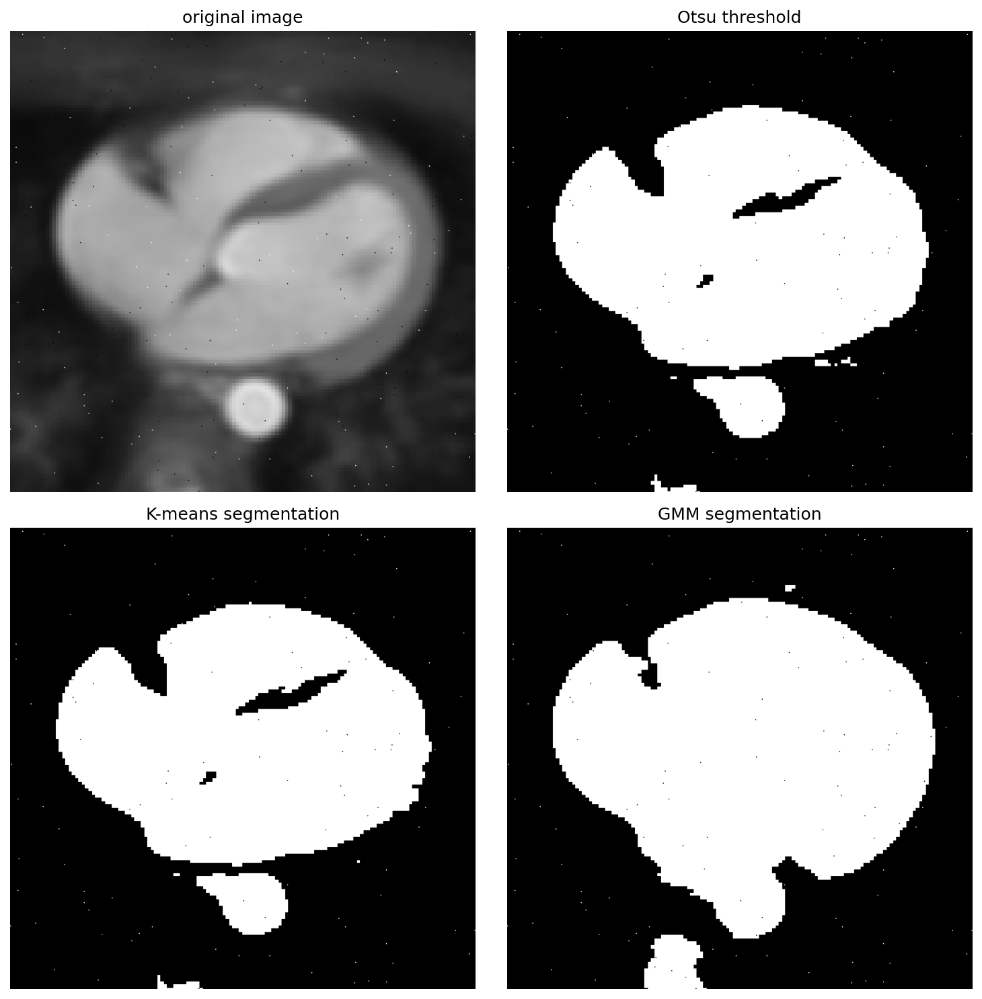
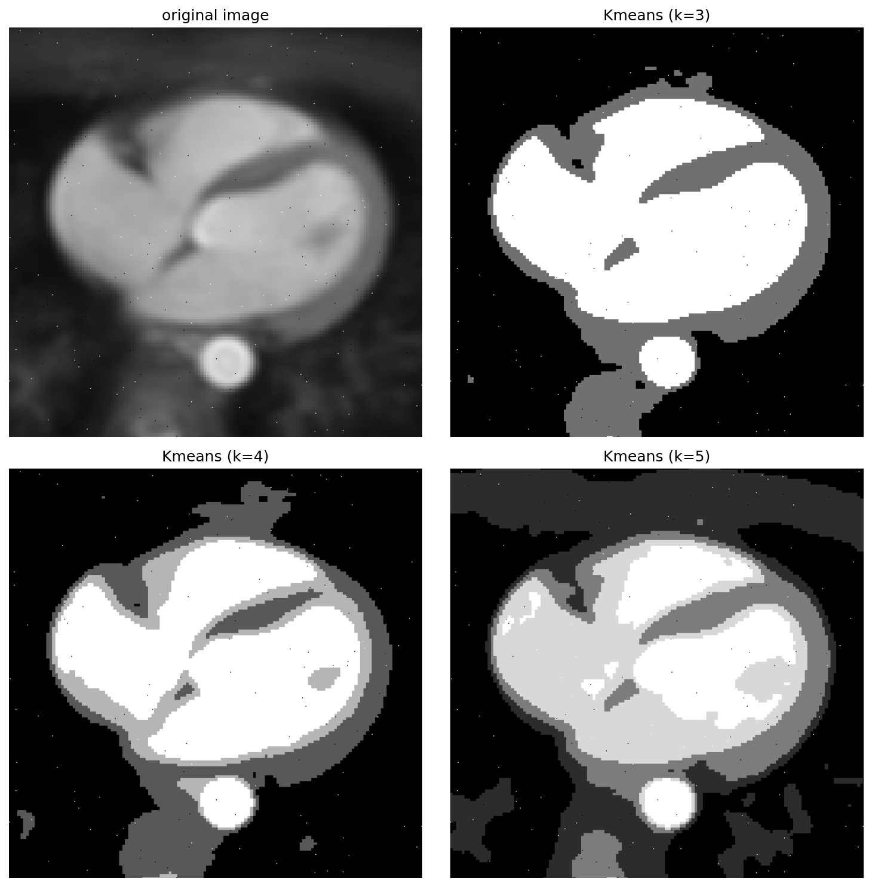
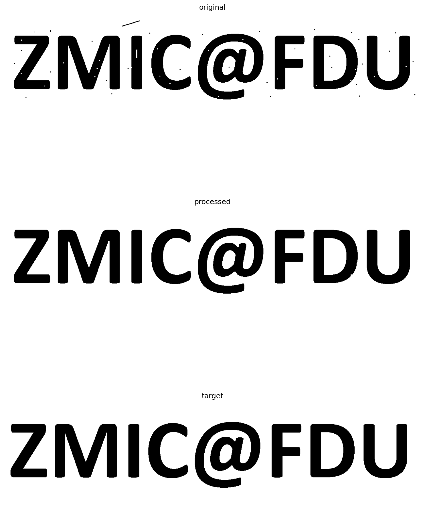

<font face="Times">

<center>

### 图像处理与可视化: Homework 6

陈皓阳 `23307130004@m.fudan.edu.cn`

</center>

<br>

#### [HW6-1] 实现K类均值分类的分割算法或基于高斯混合模型的分割算法（备注：二选一就行，不可以调用别的库实现的函数），并使用噪声污染过的图像（如P=0.1%的椒盐噪声）测试一下算法：

##### （1）测试二类分割，并对比自己实现的算法的分割结果与阈值算法（如OSTU或基于最大熵）二值化的结果；



* `comparison_6-1-1.png` 是原图像 `saltPepper_heart.png`（受椒盐噪声污染的图像，噪声概率为0.1%），Otsu阈值分割结果 `Otsu_saltPepper_heart.png`，K-means二类分割结果 `kmeans2_saltPepper_heart.png` 和 GMM二类分割结果 `gmm2_saltPepper_heart.png` 的并列展示。

* 从对比结果可以看出，Otsu阈值分割、Kmeans和GMM都能实现基本的二值分割，但都受到椒盐噪声的影响，在噪声点处出现了错误分类。

<br>

```python
from tkinter import N
import numpy as np
from PIL import Image
import os
import matplotlib.pyplot as plt

# get image with salt and pepper noise
def salt_pepper_noise(image_path, a, b, pa, pb, plot=True):
    """
    Parameter:
        a: intensity value for pepper noise
        b: intensity value for salt noise
        pa: probability of pepper noise
        pb: probability of salt noise
    Return:
        noisy_image: image with salt-and-pepper noise
        noise_array: noise array
    """
    image = Image.open(image_path).convert('L')
    image_array = np.array(image).astype(np.float32)
    M, N = image_array.shape

    # mask matrix
    rand = np.random.uniform(0, 1, (M, N))
    pepper_mask = rand < pa
    salt_mask = (rand >= pa) & (rand < pa + pb)
    keep_mask = rand >= (pa + pb)

    # multiplicative mask: keep original pixel
    mul_mask = keep_mask.astype(np.float32)
    # additive mask: replace original pixel with intensity a or b
    add_mask = np.zeros((M, N), dtype=np.float32)
    add_mask[pepper_mask] = a
    add_mask[salt_mask] = b

    # apply masks
    withnoise_array = image_array * mul_mask + add_mask
    
    # save
    image_dir = "image"
    file_name = os.path.basename(image_path)
    withnoise_array = withnoise_array.astype(np.uint8)
    withnoise_image = Image.fromarray(withnoise_array)
    save_path = os.path.join(image_dir, f"saltPepper_{file_name}")
    withnoise_image.save(save_path)

    return withnoise_array

# global Otsu threshold algorithm
def otsu_threshold(image_path, L=256, save_result=True):

    image = Image.open(image_path).convert('L')
    array = np.array(image)
    height, width = array.shape
    count = height * width

    hist = np.zeros(L, dtype = np.int32)
    for i in range(height):
        for j in range(width):
            hist[array[i, j]] += 1
    p = hist.astype(np.float64) / count
    
    P1 = np.zeros(L) 
    m1 = np.zeros(L)
    P1[0] = p[0]
    m1[0] = 0
    for k in range(1, L):
        P1[k] = P1[k-1] + p[k]
        m1[k] = m1[k-1] + k * p[k]
    mG = np.sum(np.arange(L) * p)
    
    # compute between-class variance
    max_variance = -1
    best_threshold = 0
    for k in range(L):
        if P1[k] > 0 and P1[k] < 1:
            variance = (mG * P1[k] - m1[k])**2 / (P1[k] * (1 - P1[k]))
            if variance > max_variance:
                max_variance = variance
                best_threshold = k
    
    threshold = np.zeros_like(array)
    threshold[array > best_threshold] = L - 1
    
    # save processed image
    if save_result:

        image_dir = "image"
        file_name = os.path.basename(image_path)
        threshold_img = Image.fromarray(threshold)
        save_path = os.path.join(image_dir, f"Otsu_{file_name}")
        threshold_img.save(save_path)       

    return threshold

# kmeans algorithm
def kmeans_seg(k, image_path, save_result=True):

    image = Image.open(image_path).convert('L')
    array = np.array(image)
    height, width = array.shape
    
    mean = np.random.uniform(0, 256, k)
    mask = np.zeros((height, width))

    epsilon = 1e-1
    maxIteration = 100
    iteration = 0

    while iteration < maxIteration:
        sum, count = np.zeros(k), np.zeros(k)
        for i in range(height):
            for j in range(width):
                value = array[i, j]
                distance = np.abs(mean - value)
                index = np.argmin(distance)
                mask[i, j] = index
                sum[index] += value
                count[index] += 1
        
        newMean = np.zeros(k)
        for index in range(k):
            newMean[index] = sum[index] / count[index]
        if np.linalg.norm(newMean - mean) < epsilon:
            break

        mean = newMean
        iteration += 1
    
    grey = np.linspace(0, 255, k).astype(np.uint8)
    segarray = np.zeros((height, width))
    for i in range(height):
        for j in range(width):
            segarray[i, j] = grey[int(mask[i, j])]

    segarray = segarray.astype(np.uint8)

    # save processed image
    if save_result:

        image_dir = "image"
        file_name = os.path.basename(image_path)
        segarray_img = Image.fromarray(segarray)
        save_path = os.path.join(image_dir, f"kmeans{k}_{file_name}")
        segarray_img.save(save_path) 

    return segarray

# GMM algorithm
def gmm_seg(k, image_path, save_result=True):

    image = Image.open(image_path).convert('L')
    array = np.array(image)
    height, width = array.shape
    N = height * width
    X = array.flatten().astype(np.float64)

    # initialize
    pi = np.ones(k) / k
    mu = np.random.uniform(0, 256, k)
    sigma2 = np.ones(k) * 25
    P = np.zeros((N, k))

    epsilon = 1e-1
    maxIteration = 100
    iteration = 0

    while iteration < maxIteration:
        # E-step: update P(zi | xi, theta)
        for i in range(N):
            numerator = np.zeros(k)
            for j in range(k):
                numerator[j] = pi[j] * (1.0 / np.sqrt(2 * np.pi * sigma2[j])) * \
                              np.exp(-0.5 * (X[i] - mu[j]) ** 2 / sigma2[j])
            denominator = np.sum(numerator)
            P[i, :] = numerator / denominator

        # M-step: update theta
        newMu = np.zeros(k)
        newSigma2 = np.zeros(k)
        newPi = np.zeros(k)

        for j in range(k):
            sumProb = np.sum(P[:, j])
            newMu[j] = np.sum(P[:, j] * X) / sumProb
            newSigma2[j] = np.sum(P[:, j] * (X - newMu[j]) ** 2) / sumProb
            newSigma2[j] = max(newSigma2[j], 1e-2) 
            newPi[j] = sumProb / N

        # check if converges
        muDiff = np.linalg.norm(newMu - mu)
        sigmaDiff = np.linalg.norm(newSigma2 - sigma2)
        piDiff = np.linalg.norm(newPi - pi)
        if muDiff < epsilon and sigmaDiff < epsilon and piDiff < epsilon:
            break
        
        mu = newMu
        sigma2 = newSigma2
        pi = newPi
        iteration += 1

    # segragate
    mask = np.argmax(P, axis = 1).reshape(height, width)
    grey = np.linspace(0, 255, k).astype(np.uint8)
    segarray = np.zeros((height, width), dtype = np.uint8)
    for i in range(height):
        for j in range(width):
            segarray[i, j] = grey[mask[i, j]]

    # save processed image
    if save_result:

        image_dir = "image"
        file_name = os.path.basename(image_path)
        segarray_img = Image.fromarray(segarray)
        save_path = os.path.join(image_dir, f"gmm{k}_{file_name}")
        segarray_img.save(save_path) 

    return segarray

if __name__ == "__main__":

    # get image with salt and pepper noise
    image_dir = "image"
    image_path = os.path.join(image_dir, "heart.png")
    salt_pepper_noise(image_path, a = 0, b = 255, pa = 0.0005, pb = 0.0005)

    withnoise_image_path = os.path.join(image_dir, "saltPepper_heart.png")
    withnoise_image = Image.open(withnoise_image_path)
    withnoise_array = np.array(withnoise_image)

    # [HW6-1](1)
    # global OSTU threshold
    threshold = otsu_threshold(withnoise_image_path, L = 256, save_result=True)

    # kmeans and GMM segregation
    kmeans2 = kmeans_seg(2, withnoise_image_path, save_result=True)
    gmm2 = gmm_seg(2, withnoise_image_path, save_result=True)

    # comparison: original, otsu, kmeans, gmm    
    fig, axes = plt.subplots(2, 2, figsize=(10, 10))

    axes[0, 0].imshow(withnoise_array, cmap='gray')
    axes[0, 0].set_title('original image')
    axes[0, 0].axis('off')

    axes[0, 1].imshow(threshold, cmap='gray')
    axes[0, 1].set_title('Otsu threshold')
    axes[0, 1].axis('off')

    axes[1, 0].imshow(kmeans2, cmap='gray')
    axes[1, 0].set_title('K-means segmentation')
    axes[1, 0].axis('off')

    axes[1, 1].imshow(gmm2, cmap='gray')
    axes[1, 1].set_title('GMM segmentation')
    axes[1, 1].axis('off')

    plt.tight_layout()
    plt.savefig(os.path.join(image_dir, f"comparison_6-1-1"), bbox_inches='tight', dpi=150)
    plt.close()
```

<br>

<div STYLE="page-break-after: always;"></div>


##### （2）测试多类（大于等于三类）分割（请自己设定分割标签类别的个数）；



* `comparison_6-1-2.png` 是原图像 `saltPepper_heart.png`（受椒盐噪声污染的图像，噪声概率为0.1%），Kmeans三类分割结果 `kmeans3_saltPepper_heart.png`，Kmeans四类分割结果 `kmeans4_saltPepper_heart.png` 和 Kmeans五类分割结果 `kmeans5_saltPepper_heart.png` 的并列展示。

* 从对比结果可以看出，当k=3时，分类效果比较好，能够较好地分割出图像的主要区域，随k增大时，可能会分割出一些无意义的类别，导致过度分割。

<br>

```python
if __name__ == "__main__":

    # ...
    # [HW6-1](1)
    # ...
    # [HW6-1](2)
    kmeans3 = kmeans_seg(3, withnoise_image_path, save_result=True)
    kmeans4 = kmeans_seg(4, withnoise_image_path, save_result=True)
    kmeans5 = kmeans_seg(5, withnoise_image_path, save_result=True)

    # comparison: original, kmeans with class 3, 4, 5
    fig, axes = plt.subplots(2, 2, figsize=(10, 10))

    axes[0, 0].imshow(withnoise_array, cmap='gray')
    axes[0, 0].set_title('original image')
    axes[0, 0].axis('off')

    axes[0, 1].imshow(kmeans3, cmap='gray')
    axes[0, 1].set_title('Kmeans (k=3)')
    axes[0, 1].axis('off')

    axes[1, 0].imshow(kmeans4, cmap='gray')
    axes[1, 0].set_title('Kmeans (k=4)')
    axes[1, 0].axis('off')

    axes[1, 1].imshow(kmeans5, cmap='gray')
    axes[1, 1].set_title('Kmeans (k=5)')
    axes[1, 1].axis('off')

    plt.tight_layout()
    plt.savefig(os.path.join(image_dir, f"comparison_6-1-2"), bbox_inches='tight', dpi=150)
    plt.close()
```

<br>


##### （3）针对噪声图像，讨论为什么分割的结果不准确，有什么方法可以取得更好的分割结果（备注：不要求实现该方法，只是讨论）。

* 椒盐噪声只分布在0和255两个灰度值上，因此在kmeans聚类时，带有椒盐噪声的像素点一定会被分到均值最低的类或均值最高的类。kmeans算法不考虑图像的空间信息，只是根据灰度值的大小对所有像素的灰度值进行聚类，当某个像素点出现了椒盐噪声，算法没有考虑到其周围像素点的信息。综上所述，kmeans对噪声图像的分割结果也是带噪声的。

* 如果想要得到更好的分割结果，可先用中值滤波器对椒盐噪声先进行去噪操作，再进行分割。对于其他类型的噪声，需要选取适合的滤波器，如高斯滤波器，先去噪、后分割。

<div STYLE="page-break-after: always;"></div>

#### [HW6-2] 请使用课程学习的形态学操作实现二值图像的补洞和离散点去除。形态学操作功能要自己代码实现，不能调用库。



* `comparison_6-2.png` 是原图像 `zmic_fdu_noise.bmp`（受椒盐噪声污染的二值图像），经过形态学操作处理后的图像（先进行闭运算去除离散点，再进行开运算补洞）和目标图像 `zmic_fdu.bmp`（理想的无噪声图像）的并列展示。

* 从对比结果可以看出，通过闭运算和开运算的组合，能够有效去除图像中的离散噪声点并填补图像中的空洞，处理后的图像与目标图像非常接近，只是一个噪声点落在接近前景边界处，导致形成一个缺口。

```python
import numpy as np
from PIL import Image
from numba import njit
import os
import matplotlib.pyplot as plt
import time

@njit()
def erode(array, k):
    
    height, width = array.shape
    erodeArray = np.zeros((height, width), dtype=array.dtype)

    half = k // 2
    for i in range(height):
        for j in range(width):
            top = max(0, i - half)
            bottom = min(height, i + half + 1)
            left = max(0, j - half)
            right = min(width, j + half + 1)
            erodeArray[i, j] = np.min(array[top:bottom, left:right])

    return erodeArray

@njit()
def dilate(array, k):
    
    height, width = array.shape
    dilateArray = np.zeros((height, width), dtype=array.dtype)

    half = k // 2
    for i in range(height):
        for j in range(width):
            top = max(0, i - half)
            bottom = min(height, i + half + 1)
            left = max(0, j - half)
            right = min(width, j + half + 1)
            dilateArray[i, j] = np.max(array[top:bottom, left:right])

    return dilateArray

@njit()
def opening(array, k):

    erodeArray = erode(array, k)
    openArray = dilate(erodeArray, k)

    return openArray

@njit()
def closing(array, k):

    dilateArray = dilate(array, k)
    closeArray = erode(dilateArray, k)

    return closeArray

if __name__ == "__main__":

    image_dir = "image"
    image_path = os.path.join(image_dir, "zmic_fdu_noise.bmp")
    image = Image.open(image_path)
    array = np.array(image)

    kclose = 5
    kopen = 5

    start = time.time()
    closeArray = closing(array, kclose)
    processArray = opening(closeArray, kopen)
    print(time.time() - start)

    target_path = os.path.join(image_dir, "zmic_fdu.bmp")
    target_image = Image.open(target_path)
    target_array = np.array(target_image)

    fig, axes = plt.subplots(3, 1, figsize=(10, 15))

    axes[0].imshow(array, cmap='gray')
    axes[0].set_title('original')
    axes[0].axis('off')

    axes[1].imshow(processArray, cmap='gray')
    axes[1].set_title('processed')
    axes[1].axis('off')

    axes[2].imshow(target_array, cmap='gray')
    axes[2].set_title('target')
    axes[2].axis('off')

    plt.tight_layout()
    plt.savefig(os.path.join(image_dir, f"comparison_6-2"), bbox_inches='tight', dpi=150)
    plt.close()
```


<br>