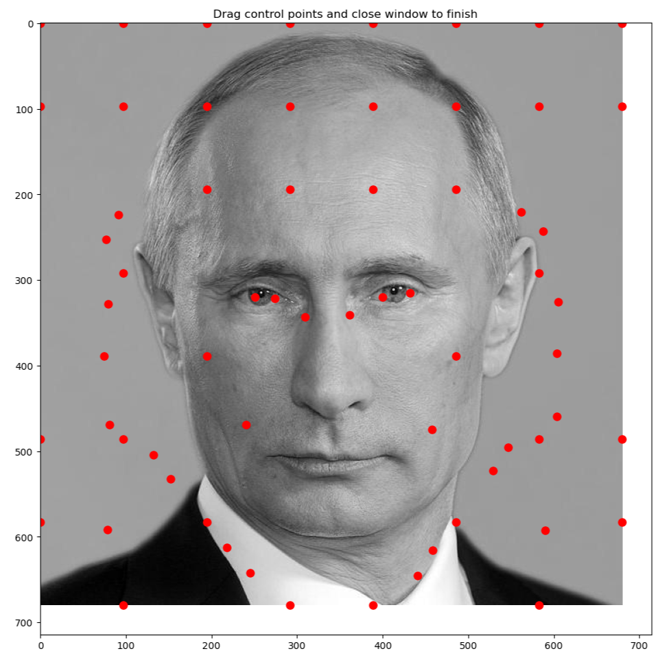
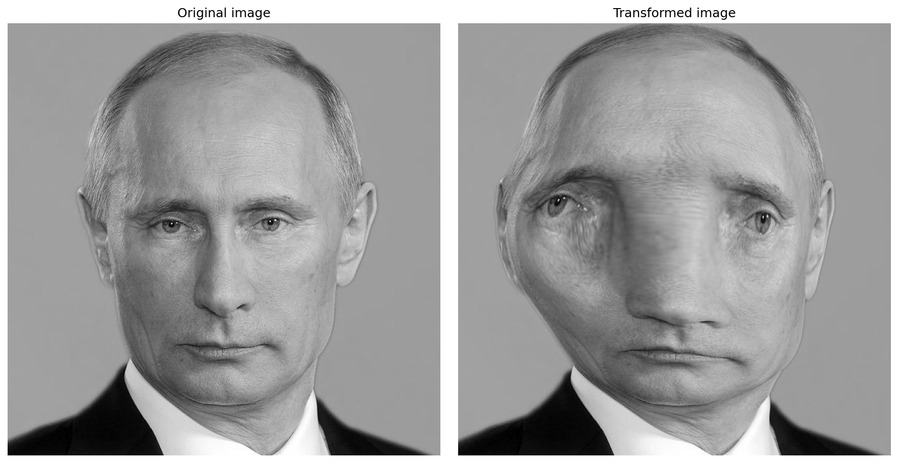

<font face="Times">

<center>

### 图像处理与可视化: Homework 7

陈皓阳 `23307130004@m.fudan.edu.cn`

</center>

<br>

#### 作业7 图像的空间变换

##### （1）一个局部仿射变换（或基于FFD的形变算法）空间变换（记此变换为 $D$），（2）并把这个空间变换应用于实现基于反向的图像变换过程（记反向图变换为 $T^{-1}$，则可直接令 $T^{-1} = D$），从而实现图像甲到图像乙的图像变换。作业的基本算法内容参考课堂上讲解和课件。（备注：可以参考其他有关的学术资料改进效果（optional），但不能只使用其他的算法而没有实现题目要求的两个基本内容。）


**Free-Form Deformation 原理**

FFD 的核心想法是：将控制点规则化，并且把控制点的位移产生的影响控制在局部，其变换公式为：$Y = T(X) = X + Q_{\text{local}}(X)$，其中 $Q_{\text{local}}(X)$ 表示 $X$ 发生的位移：

$$Q_{\text{local}}(X) = \sum_{i=-1}^{2} \sum_{j=-1}^{2} \Phi_{i+i_x, j+j_y} \beta_i(u) \beta_j(v)$$

其中归一化坐标 $u$、$v$ 和网格索引 $i_x$、$j_y$ 的定义为：

$$u = \frac{x - P_{00}[0]}{l_x} - i_x, \quad v = \frac{y - P_{00}[1]}{l_y} - j_y$$

$$i_x = \left\lfloor \frac{x - P_{00}[0]}{l_x} \right\rfloor, \quad j_y = \left\lfloor \frac{y - P_{00}[1]}{l_y} \right\rfloor$$

而 $\Phi_{i+i_x, j+j_y}$ 表示 $(i + i_x, j + j_y)$ 处的控制点的位移，$\beta_i$、$\beta_j$ 是分段形式的 B-样条核函数。


对于 $u \in [0, 1)$，B-样条核函数 $\beta_i(u)$ 的表达式为：

$$\beta_{-1}(u) = \frac{(1-u)^3}{6}, \quad \beta_0(u) = \frac{3u^3 - 6u^2 + 4}{6}, \quad \beta_1(u) = \frac{-3u^3 + 3u^2 + 3u + 1}{6}, \quad \beta_2(u) = \frac{u^3}{6}$$


<br>

```python
# FFD.py
import numpy as np

def cubic_spline(u, index: int):
    r"""another expression of FFD where u belongs to [0, 1)

    Args:
        u: one component of the control point coordinates
        index: -1, 0, 1, 2
    Return:
        weight: the weight of the control point in certain dimension
    """
    if index == -1:
        weight = (1 - u)**3 / 6
    elif index == 0:
        weight = (3*u**3 - 6*u**2 + 4) / 6
    elif index == 1:
        weight = (-3*u**3 + 3*u**2 + 3*u + 1) / 6
    elif index == 2:
        weight = u**3 / 6
    else:
        raise ValueError("index is not {-1, 0, 1, 2}")
    
    return weight


def construct_controlShiftDist(height: int, width: int, m: int, n: int):
    r"""
    construct initial controlShiftDist

    Args:
        height, width: about image
        m, n: the number of intervals in height and width direction
              I'll choose m and n by which the image size is divisible.
    
    Returns:
        controlShiftDist: {(index_x, index_y): (0, 0)}, note that x and y are index, not true coordinates
        lx: length of intervals in height direciton
        ly: length of intervals in width direciton
    """
    controlShiftDist = {}
    lx = height / m
    ly = width / n
    for i in range(m + 1):
        for j in range(n + 1):
            controlShiftDist[(i, j)] = np.array([0, 0])
    return controlShiftDist, lx, ly

def ffd(height: int, width: int, lx: int, ly: int, controlShiftDist: dict) -> np.array:
    r"""
    Free-form deformation, given the shift of control points.
    obtain the coordinates of the target image inversely mapped back to the original image.

    Args:
        height, width: about image
        lx, ly: the length of interval in either height and width direction
        controlShiftDict: {(index_x, index_y): (delta_x, delta_y)}
    Return:
        backmap: tensor(height * width * 2), backmap[:, x, y] gets the backmap coordinates of (x, y)
    """
    # backmap[x, y, 1] has the first coordinate, backmap[x, y, 2] has the second one
    backmap = np.zeros((height, width, 2))
    for x in range(height):
        for y in range(width):
            backmap[x, y, :] = np.array([x, y])
    
    # compyte index: int and residual: [0, 1)
    for x in range(height):
        dist_1 = (x - 0) / lx
        ix = int(dist_1)  
        u = dist_1 - ix  
        for y in range(width):
            dist_2 = (y - 0) / ly
            iy = int(dist_2)  
            v = dist_2 - iy  

            # compute weighted shift, using cubic spline
            shiftSum = np.array([0.0, 0.0])
            for i in [-1, 0, 1, 2]:
                for j in [-1, 0, 1, 2]:
                    delta = controlShiftDist.get((ix + i, iy + j), np.array([0, 0]))
                    shiftSum[0] += delta[0] * cubic_spline(u, i) * cubic_spline(v, j)
                    shiftSum[1] += delta[1] * cubic_spline(u, i) * cubic_spline(v, j)
            
            backmap[x, y, :] = np.array([x, y]) + shiftSum
    
    # trip
    backmap[:, :, 0] = np.clip(backmap[:, :, 0], 0, height - 1)
    backmap[:, :, 1] = np.clip(backmap[:, :, 1], 0, width - 1)

    return backmap
```

<br>

<div STYLE="page-break-after: always;"></div>


**Back-Transformation 原理**

对于目标图像中的每个像素位置 $(x, y)$，反向变换计算其在原图像中对应的位置 $(x', y')$，然后通过插值获取像素值。

反映射：对于目标图像像素 $(x, y)$，使用 FFD 公式计算位移 $Q_{\text{local}}(x, y)$，得到原图像中的对应位置 $(x', y') = (x, y) + Q_{\text{local}}(x, y)$。

双线性插值：对于浮点坐标 $(x', y')$，找到周围四个整数像素点 $(\lfloor x' \rfloor, \lfloor y' \rfloor)$、$(\lfloor x' \rfloor, \lfloor y' \rfloor + 1)$、$(\lfloor x' \rfloor + 1, \lfloor y' \rfloor)$、$(\lfloor x' \rfloor + 1, \lfloor y' \rfloor + 1)$，设其像素值为 $I_{00}$、$I_{01}$、$I_{10}$、$I_{11}$，插值权重 $u = x' - \lfloor x' \rfloor$、$v = y' - \lfloor y' \rfloor$，则插值结果为：$I(x', y') = (1-u)(1-v) \cdot I_{00} + (1-u)v \cdot I_{01} + u(1-v) \cdot I_{10} + uv \cdot I_{11}$

<br>

以下是实现效果：



* `drag.png` 是拖拽控制点的结果，由于直接令 $T^{-1} = D$，拖拽后控制点的意义是：原图像的该位置应该变换至目标图像的拖拽前控制点的位置。为了使得控制点完全均匀，先观察图像的长宽，然后选择可以整除长宽的间距数量，最终，长度方向的控制点数量是长度间隔数量加一，宽度方向的控制点数量是宽度间隔数量加一。



* `FFDbacktrans.png` 是原图像 `putin.jpg` 和基于FFD进行反向变换后的图像的并列展示。运行 `backtrans.py`，先会展示添加了网格状控制点的原图像，用户可以随意拖拽控制点；关闭该展示窗口后，`backtrans.py` 调用 `FFD.py` 并利用三次样条函数获得每个点基于其临近 16 个控制点的位移计算出来的位移，进而获得每个点变换后的位置；最终，利用双线性插值获得每个点变换后的位置在原图像上的像素值。

<br>

```python
# backTrans.py
import numpy as np
from PIL import Image
from FFD import *
import os
import matplotlib.pyplot as plt
import matplotlib
matplotlib.use('TkAgg')  

def load_image(image_path):
    image = Image.open(image_path)
    image_array = np.array(image)
    return image_array

def bilinear_interpolation(backmap: np.array, original_array: np.array) -> np.array:
    r"""
    Args:
        backmap: shape (height, width, 2), coordinates information
        original_array: shape (height, width), coordinates with intensity
    Return:
        trans_array: shape (height, width), backmap coordinates with intensity
    """
    height, width = original_array.shape
    trans_array = np.zeros((height, width))
    # shape (height, width)
    coords_x = backmap[:, :, 0]
    coords_y = backmap[:, :, 1]
    # shape (height, width)
    min_x = np.floor(coords_x).astype(int)
    min_y = np.floor(coords_y).astype(int)
    max_x = np.minimum(min_x + 1, height - 1)
    max_y = np.minimum(min_y + 1, width - 1)
    # shape (height, width)
    u = coords_x - min_x
    v = coords_y - min_y
    # shape (height, width)
    value00 = original_array[min_x, min_y]
    value01 = original_array[min_x, max_y]
    value10 = original_array[max_x, min_y]
    value11 = original_array[max_x, max_y]
    # shape (height, width)
    trans_array = (1-u)*(1-v)*value00 + (1-u)*v*value01 + u*(1-v)*value10 + u*v*value11

    return trans_array 

class ControlPointDragger:
    def __init__(self, array, m, n):
        self.array = array
        self.height, self.width = array.shape
        self.controlShiftDist, self.lx, self.ly = construct_controlShiftDist(self.height, self.width, m, n)
        self.dragged_point = None
        self.points = {}
        self.plot_to_key = {}
        self._setup_gui()
    
    def _setup_gui(self):
        self.fig, self.ax = plt.subplots(1, 1, figsize=(10, 10))
        self.ax.imshow(self.array, cmap='gray')
        self.ax.set_title('Drag control points and close window to finish', fontsize=12)
        self.ax.axis('off')
        
        for (i, j) in self.controlShiftDist.keys():
            initX, initY = i * self.lx, j * self.ly
            # ax.plot returns a list
            plot, = self.ax.plot(initY, initX, 'ro', markersize=5, picker=10)
            self.points[(i, j)] = {
                'plot': plot,
                'currentX': initX,
                'currentY': initY,
                'initialX': initX,
                'initialY': initY
            }
            self.plot_to_key[plot] = (i, j)
        
        plt.tight_layout()
        
        self.fig.canvas.mpl_connect('pick_event', self.on_pick)
        self.fig.canvas.mpl_connect('motion_notify_event', self.on_motion)
        self.fig.canvas.mpl_connect('button_release_event', self.on_release)
    
    def on_pick(self, event):
        # event: click the control point, dragged_point is the current point
        if event.artist in self.plot_to_key:
            self.dragged_point = self.plot_to_key[event.artist]
    
    def on_motion(self, event):
        # examine if any control point has been clicked, also examine if the mouse is inside the image
        if self.dragged_point is None or event.inaxes != self.ax:
            return
        if event.xdata is None or event.ydata is None:
            return
        
        # drag the point and clip
        newX = np.clip(event.ydata, 0, self.height - 1)
        newY = np.clip(event.xdata, 0, self.width - 1)
        
        p = self.points[self.dragged_point]
        # update the visual location of the point 
        p['plot'].set_data([newY], [newX])
        p['currentX'] = newX
        p['currentY'] = newY
        self.fig.canvas.draw()
    
    def on_release(self, event):
        self.dragged_point = None
    
    def get_controlShiftDist(self):
        for (i, j), p in self.points.items():
            dx = p['currentX'] - p['initialX']
            dy = p['currentY'] - p['initialY']
            self.controlShiftDist[(i, j)] = np.array([dx, dy])
        return self.controlShiftDist
    
    def show(self):
        plt.show()

def backtrans(array: np.array, m: int, n: int) -> np.array:
    r"""
    Back-Transform  

    Args:
        array: the array of original image
        m: number of intervals in height direction
        n: number of intervals in width direction
           choose m and n by which the size of image is divisible
    Return:
        transarray: the back-transformed array
    """
    dragger = ControlPointDragger(array, m, n)
    dragger.show()
    
    controlShiftDist = dragger.get_controlShiftDist()
    backmap = ffd(dragger.height, dragger.width, dragger.lx, dragger.ly, controlShiftDist)
    transarray = bilinear_interpolation(backmap, array)
    
    return transarray

if __name__ == "__main__":

    image_dir = "image"
    image_name = "putin.jpg"
    image_path = os.path.join(image_dir, image_name)

    array = load_image(image_path)
    print(f"Size of image {image_path}: {array.shape}")
    m = int(input("Enter m (number of intervals in height direction): "))
    n = int(input("Enter n (number of intervals in width direction): "))

    # back transformation
    transarray = backtrans(array, m, n)

    # comparison
    fig, axes = plt.subplots(1, 2, figsize=(12, 6))

    axes[0].imshow(array, cmap='gray')
    axes[0].set_title('Original image')
    axes[0].axis('off')

    axes[1].imshow(transarray, cmap='gray')
    axes[1].set_title('Transformed image')
    axes[1].axis('off')

    plt.tight_layout()
    plt.savefig(os.path.join(image_dir, "FFDbacktrans.png"), bbox_inches='tight', dpi=150)
    plt.show()
```


<br>