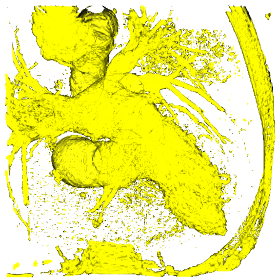
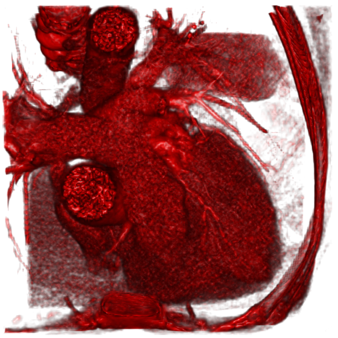
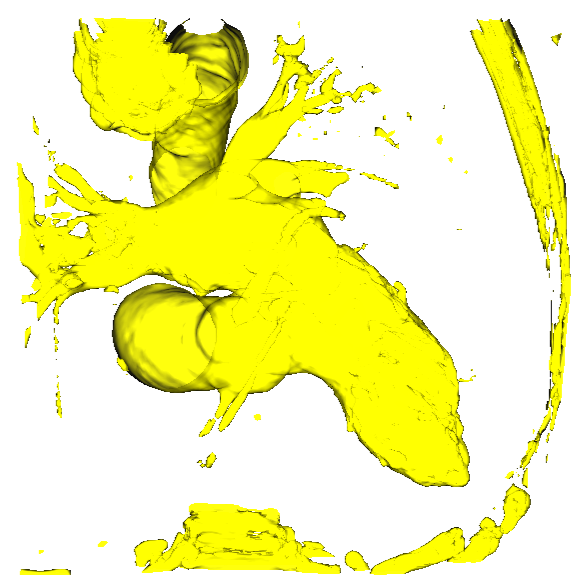
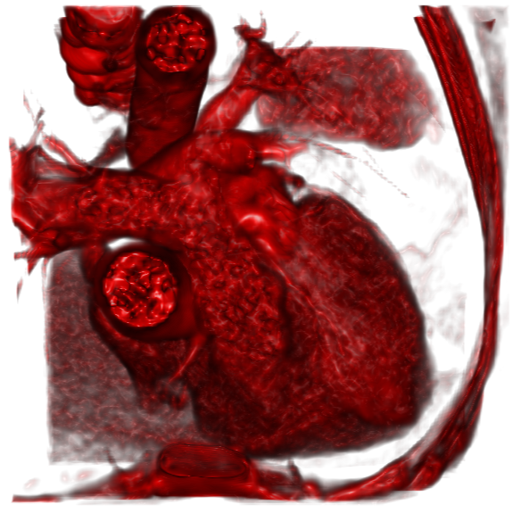

<font face="Times">

<center>

### 图像处理与可视化: Homework 8

陈皓阳 `23307130004@m.fudan.edu.cn`

</center>

<br>

#### [hw8.1] 阅读了解VTK（VTK - The Visualization Toolkit, www.vtk.org），学习某个编程环境下调用VTK库进行可视化。调用可视化渲染引擎库VTK，实现三维体数据完整的渲染过程（如光照模型，颜色设置等）。备注：需要实现的渲染过程二选一：(1) 实现等值面渲染，(2) 或实现体渲染。

##### 等值面渲染



```python
"""surfaceRender.py (old version)"""
import vtk
import nibabel as nib
from vtkmodules.util import numpy_support

ifReduceSegment = True

### surface render
## 1: Source / Reader
## load files (e.g., .nii.gz) and convert them into vtk data structures
## file -> numpy array -> vtkImageData
file_path = "image_lr.nii.gz"
img = nib.load(file_path)
img_data = img.get_fdata()
dims = img.shape
# pixdim[1], pixdim[2], pixdim[3] represents the physical spacing in x, y, z
spacing = img.header["pixdim"][1: 4]

# create vtk image container
vtk_image = vtk.vtkImageData()
vtk_image.SetDimensions(dims[0], dims[1], dims[2])
vtk_image.SetSpacing(spacing[0], spacing[1], spacing[2])

# transfer (x, y, z) into (z, y, x) because the last index (x) changes the fastest
vtk_array = numpy_support.numpy_to_vtk(img_data.transpose(2, 1, 0).flatten(), deep=True)
# load data into spatial scalar field
vtk_image.GetPointData().SetScalars(vtk_array)

## 2. Filter: turn volume data into surface
## apply geometric algorithms to extract or modify data
## vtkImageData -> vtkPolyData
extractor = vtk.vtkMarchingCubes()
extractor.SetInputData(vtk_image)
extractor.SetValue(0, 150)

# create triangle strips
stripper = vtk.vtkStripper()
stripper.SetInputConnection(extractor.GetOutputPort())

## 3. Mapper
## map geometry into graphics that the rendering engine can understand
mapper = vtk.vtkPolyDataMapper()
mapper.SetInputConnection(stripper.GetOutputPort())
mapper.ScalarVisibilityOff()

## 4. Actor
## represent an object in the rendering scene with visual properties
actor = vtk.vtkActor()
actor.SetMapper(mapper)
# yellow foreground
actor.GetProperty().SetColor(1, 1, 0)
actor.GetProperty().SetOpacity(0.95)
# mirror reflection intensity
actor.GetProperty().SetSpecular(1.0)

## 5. Renderer
## manage the virtual scene including all actors
renderer = vtk.vtkRenderer()
renderer.AddActor(actor)
# white background
renderer.SetBackground(1, 1, 1)

## 6. Render Window
## provide a window on the operating system 
render_window = vtk.vtkRenderWindow()
render_window.AddRenderer(renderer)
render_window.SetSize(800, 800)

## 7. Interactor
## enable user interaction
interactor = vtk.vtkRenderWindowInteractor()
interactor.SetRenderWindow(render_window)

## final pipeline
# execute the pipeline to render the first frame
render_window.Render()

# save: window to image
# render: actor + renderer -> RenderWindow
# capture: RenderWindow -> vtkWindowToImageFilter
# output: vtkWindowToImageFilter -> vtkPNGWriter
w2i = vtk.vtkWindowToImageFilter()
w2i.SetInput(render_window) 
w2i.Update()

img_writer = vtk.vtkPNGWriter()
img_writer.SetFileName("surfaceRender.png")
img_writer.SetInputConnection(w2i.GetOutputPort())
img_writer.Write()

# interacte
interactor.Initialize()
interactor.Start()
```

<div style="page-break-after: always;"></div>

##### 体渲染



```python
"""volumeRender.py (new version)""" 
import vtk
import nibabel as nib
from vtkmodules.util import numpy_support

reduceSegment = True

### volume render
## 1: Source / Reader
## ...

## 2. construct transfer function 
volume_property = vtk.vtkVolumeProperty()
volume_property.ShadeOn() 
volume_property.SetInterpolationTypeToLinear() 
volume_property.SetDiffuse(0.8)
volume_property.SetSpecular(0.8)

opacity_func = vtk.vtkPiecewiseFunction()
opacity_func.AddPoint(20, 0.0)   
opacity_func.AddPoint(150, 0.2)  
opacity_func.AddPoint(500, 0.8)  
volume_property.SetScalarOpacity(opacity_func)

color_func = vtk.vtkColorTransferFunction()
color_func.AddRGBSegment(0, 0.0, 0.0, 0.0, 20, 0.2, 0.0, 0.0)    
color_func.AddRGBSegment(20, 0.1, 0.0, 0.0, 128, 1.0, 0.0, 0.0)    
volume_property.SetColor(color_func)

## 3. Mapper
## implement Ray Casting algorithm
## vtkImageData -> vtkVolumeRayCastMapper
mapper = vtk.vtkGPUVolumeRayCastMapper()
if reduceSegment:
    mapper.SetInputConnection(filter.GetOutputPort())
else:
    mapper.SetInputData(vtk_image)

## 4. Actor
## represent an object in the rendering scene with visual properties
## vtkVolumeRayCastMapper -> vtkVolume
actor = vtk.vtkVolume()
actor.SetMapper(mapper)
actor.SetProperty(volume_property)

## 5. Renderer 
# ... (replace filename)
```

#### [hw8.2] 请设计一个方法消除心脏CT图像（image_lr.nii.gz）等值面渲染结果中的碎片化的面单元，如下图所示。备注：作答方式二选一：（1）可以描述说明；（2）或用代码实现和展示结果。

##### 等值面渲染去除碎片

利用高斯平滑滤波器去除噪声，三维卷积核 $G(x, y, z)$ 经过噪声区域时，该点的极端值被分散到邻域内至少 26 个体素中，使得局部峰值减小

$$G(x, y, z) = \frac{1}{\sqrt{(2\pi)^3}\sigma_x\sigma_y\sigma_z} e^{-\left(\frac{x^2}{2\sigma_x^2} + \frac{y^2}{2\sigma_y^2} + \frac{z^2}{2\sigma_z^2}\right)}$$



```python
"""surfaceRender.py (new version)""" 
import vtk
import nibabel as nib
from vtkmodules.util import numpy_support
import numpy as np

reduceSegment = True

### surface render
## 1: Source / Reader
## load files (e.g., .nii.gz) and convert them into vtk data structures
## file -> numpy array -> vtkImageData
file_path = "image_lr.nii.gz"
img = nib.load(file_path)
img_data = img.get_fdata()
dims = img.shape
# pixdim[1], pixdim[2], pixdim[3] represents the physical spacing in x, y, z
spacing = img.header["pixdim"][1: 4]

# manual realization for mean filter    
# def d3meanFilter(data):
#     dim = data.shape
#     padded = np.pad(array=data, pad_width=1, mode="constant", constant_values=0)
#     res = np.zeros_like(data)
#     for dx in range(3):
#         for dy in range(3):
#             for dz in range(3):
#                 res += padded[dx: dx+dim[0], dy: dy+dim[1], dz: dz+dim[2]]
#     return res / 27.0
# img_data = d3meanFilter(img_data)

# create vtk image container
vtk_image = vtk.vtkImageData()
vtk_image.SetDimensions(dims[0], dims[1], dims[2])
vtk_image.SetSpacing(spacing[0], spacing[1], spacing[2])

# transfer (x, y, z) into (z, y, x) because the last index (x) changes the fastest
vtk_array = numpy_support.numpy_to_vtk(img_data.transpose(2, 1, 0).flatten(), deep=True)
# load data into spatial scalar field
vtk_image.GetPointData().SetScalars(vtk_array)

if reduceSegment:
    # use VTK native 3D Gaussian smoothing (High performance)
    filter = vtk.vtkImageGaussianSmooth()
    filter.SetInputData(vtk_image)
    # set standard deviation for smoothing (about 6\sigma \times 6\sigma pixels)
    filter.SetStandardDeviations(0.8, 0.8, 0.8)
    filter.Update()

## 2. Filter: turn volume data into surface
## apply geometric algorithms to extract or modify data
## vtkImageData -> vtkPolyData
if reduceSegment:
    extractor = vtk.vtkMarchingCubes()
    extractor.SetInputConnection(filter.GetOutputPort())
else:
    extractor = vtk.vtkMarchingCubes()
    extractor.SetInputData(vtk_image)
extractor.SetValue(0, 150)

# create triangle strips
stripper = vtk.vtkStripper()
stripper.SetInputConnection(extractor.GetOutputPort())

## 3. Mapper
## map geometry into graphics that the rendering engine can understand
mapper = vtk.vtkPolyDataMapper()
mapper.SetInputConnection(stripper.GetOutputPort())
mapper.ScalarVisibilityOff()

## 4. Actor
## represent an object in the rendering scene with visual properties
actor = vtk.vtkActor()
actor.SetMapper(mapper)
# yellow foreground
actor.GetProperty().SetColor(1, 1, 0)
actor.GetProperty().SetOpacity(0.95)
# mirror reflection intensity
actor.GetProperty().SetSpecular(1.0)

## 5. Renderer
## manage the virtual scene including all actors
renderer = vtk.vtkRenderer()
renderer.AddActor(actor)
# white background
renderer.SetBackground(1, 1, 1)

## 6. Render Window
## provide a window on the operating system 
render_window = vtk.vtkRenderWindow()
render_window.AddRenderer(renderer)
render_window.SetSize(800, 800)

## 7. Interactor
## enable user interaction
interactor = vtk.vtkRenderWindowInteractor()
interactor.SetRenderWindow(render_window)

## final pipeline
# execute the pipeline to render the first frame
render_window.Render()

# save: window to image
# render: actor + renderer -> RenderWindow
# capture: RenderWindow -> vtkWindowToImageFilter
# output: vtkWindowToImageFilter -> vtkPNGWriter
w2i = vtk.vtkWindowToImageFilter()
w2i.SetInput(render_window) 
w2i.Update()

img_writer = vtk.vtkPNGWriter()
if reduceSegment:
    img_writer.SetFileName("reducedSurfaceRender.png")
else:
    img_writer.SetFileName("surfaceRender.png")
img_writer.SetInputConnection(w2i.GetOutputPort())
img_writer.Write()

# interacte
interactor.Initialize()
interactor.Start()
```

<div style="page-break-after: always;"></div>

##### 体渲染去除碎片



<br>